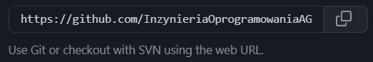

# Srawozdanie LAB_01 - Wprowadzenie, Git, Gałęzie, SSH

## Kroki
1. Zainstalowanie Gita oraz klienta SSH.

2. Sklonowanie repo za pomocą HTTPS - git clone.

3. Konfiguracja kluczy SSH, zapisanie klucza prywatnego i wykorzystanie klucza publicznego na GitHubie (poniżej).

4. Klon repo przez SSH po konfiguracji kluczy - git clone.

5. Następnie stworzenie gałęzi mojej grupy (GCL2) oraz mojej prywatnej (SR405244), dalsza praca na prywatnej.

6. Następnie utworzyłem katalog o takiej samej nazwie jak nazwa gałęzi prywatnej - SR405244.

7. Napisałem Git Hooka w następujacy sposób:  
Przejście do folderu root kolejno listing folderów ukrytych ls -a i wejście do folderu .git, kolejno do folderu hooks. 
Stworzenie skryptu o nazwie "prepare-commit-msg" czyli specjalnie zarezerwowanej nazwie dla wykonania skryptów przed stworzeniem commita
oraz wiadomości jaką zawiera.
8. Git hook zadziałał (porównanie dla wiadomosci poprawnej i nie) - kod znajduje się poniżej:

9. Umieściłem wszystko (skrypt jak i sprawko) w katalogu ./SR405244/Lab01

10. Kolejno wciągnąłem swoją gałąź do gałęzi grupowej

11. Finalnie wróciłem z gałęzi grupowej (GCL2) na swoją gałąź (SR405244) i wysłałem na "remote".


## Skrypt hooka
```
#!/bin/bash

commit_msg=$(cat $1)

if [[ ! $commit_msg =~ ^SR405244.*$ ]]; then
    echo "Commit message must start with 'SR405244'."  
    echo "Commit blocked! "  
    exit 1  
fi
```
