# Sprawozdanie LAB_02 - Git, Docker

## Kroki


1. Zainstalowanie Dockera na maszynie wirtualnej w moim przypadku Ubuntu, wedle dokumentacji: https://docs.docker.com/engine/install/ubuntu/. 
Ponad programowo zainstalowałem również Docker Compose, również na podstawie Docker Docs.
Kolejno dodałem komendę **docker** do **sudo mode** przy pomocy polecenia: **sudo usermod -aG docker $USER**, 
dzięki czemu nie trzeba podawać uprawnień roota za każdym razem wykonywania polecenia **docker**. 
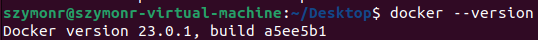

2. Wykorzystałem swoje prywatne konto na DockerHub które można znaleźć poprzez link: https://hub.docker.com/u/srpl.

3. Kolejno pobrałem pobrałem obrazy: "hello-world", "busybox", "fedora" oraz "nginx". Obrazy można znaleźć na ścieżce "/var/lib/docker/images"
(aby wejść do folderu należy zmienić prawa wykonania i posiadania folderu: **sudo chmod -R 755 docker** oraz **sudo chown root:current_user_name**)
lub skorzystać z komendy **docker images**:  
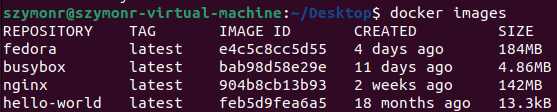

4. Następnie uruchomiłem "busybox" pod nazwą "my_name_for_busybox". Jest to oprogramowanie którego celem jest zapodanie użytkownikowi
minimalistycznego "Linux-like" systemu, szeroko wykorzystywany jako kontener czy system embedded. Flaga **-it** uruchamia kontener w trybie interaktywnym,
innymi słowy "wchodzimy" do kontenera i możemy z niego korzystać jak z klasycznego OS, przy pomocy CMD. Kolejno sprawdzam numer wersji.
Dodanie przykładowo opcjonalnej flagi **-rm** kończy działanie kontenera po wyjściu z trybu interektywnego.
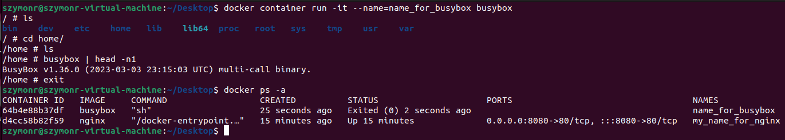

5. Uruchomienie systemu w kontenerze:
- W moim wypadku wybrałem Fedore
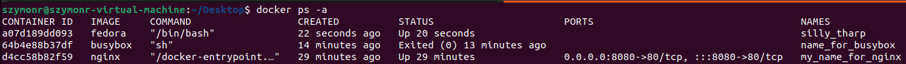
- Procesy dockera na hoście dla kontenera o Fedory
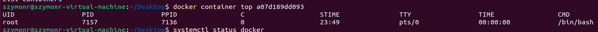
- Prezentacja PID1 w kontenerze po uprzedniej walce z zainstalowaniem podstawowych funkcjonalności okrojonego OS. 
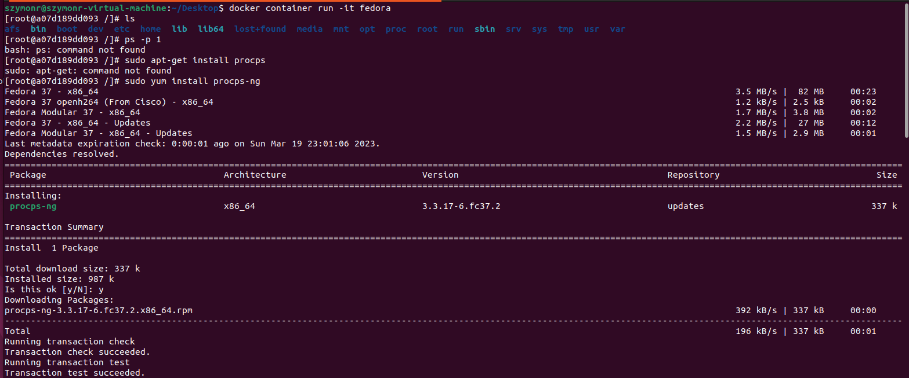
Kolejno aktualizacja pakietów w konterze - Fedora. 
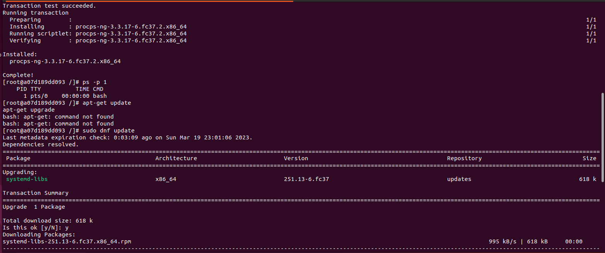
Ostatecznie wyjście z Fedory do vmki.
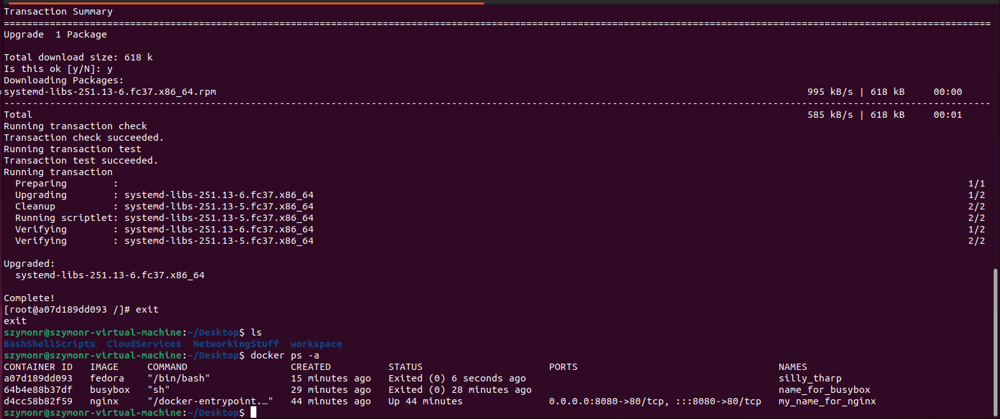

6. Kolejnym punktem było stworzenie prostego Dockerfile (zawartość na samym dole). Zaciągnąłem repo na Linux Alpine, czyli
kolejny Linux-like lightweight OS. 
- Najpierw build obrazu nazwanego lab2-image. Można było również nadać nazwę obrazu
**docker run --name lab2-container -it lab2-image**. Wypis w konsoli o poprawnym pobraniu gita.
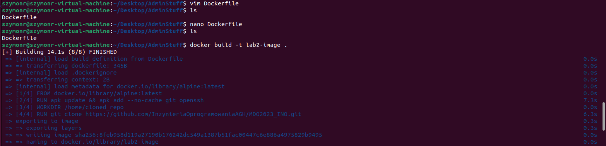
- Następnie uruchomienie kontenera. Warto zaznaczyć, iż w najnowszych wersjach Dockera zaleca się używanie **docker container run** niż **docker run** (od wersji 17.06).
Jednakże oba polecenia mają identyczne działanie.
Repozytorium zostało pobrane - sprawdzenie w trybie interaktywnym kontenera.
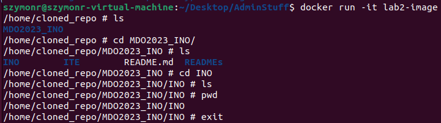

7. Listing uruchomionych kontenerów oraz ich wyczyszczenie (usunięcie - ważny tag "-f" (force) usuwający działające kontenery):
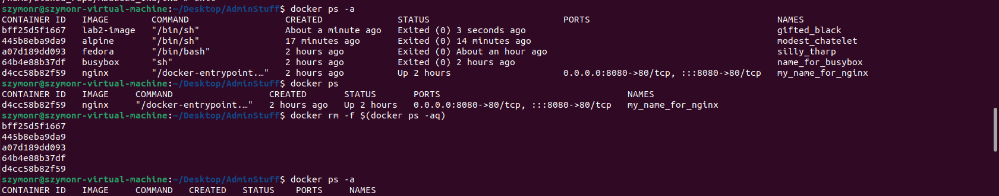

8. Wyczyszczenie obrazów (natomiast dość dziwne daty utworzenia, zwłaszcza "hello-world"???):
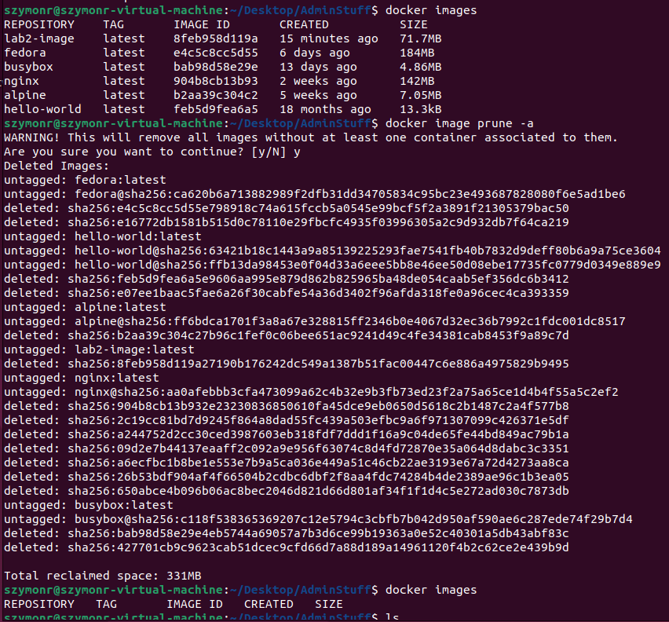

9. W katalogu Lab02 zanjduje się: Sprawozdanie02.md (+png) oraz Dockerfile.

10. Wystawiam PR do gałęzi GCL2, z SR405244.

## Dockerfile - plik tekstowy
```# Użycie Linux Alpine, najnowszej wersji jako "bazy"
FROM alpine:latest

# Instalacja git i openssh
RUN apk update && apk add --no-cache git openssh

# Sciezka gdzie powinno byc repo
WORKDIR /home/cloned_repo

# Klonowanie repo
RUN git clone https://github.com/InzynieriaOprogramowaniaAGH/MDO2023_INO.git
```
Można było również użyć "ENTRYPOINT", który zostałby uruchomiony po uruchomieniu kontenera, z referencją do skryptu .sh,
który pobrałby repo:
```
#!/bin/bash
echo "Container has started."
# Clone git repository
git clone <repo_url> /path/to/repo
# ...
```
