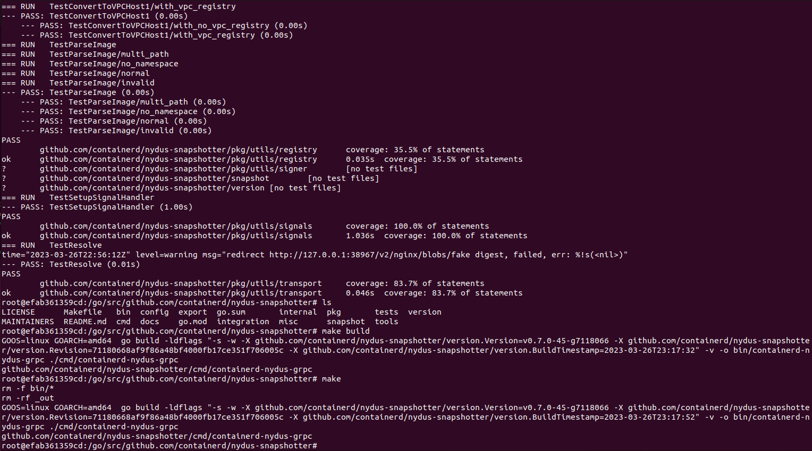

# Sprawozdanie LAB_03 - Docker files, kontener jako definicja etapu

## Przeprowadzenie buildu w kontenerze
1. Wykonałem kroki **build** i **test** wewnątrz wybranego kontenera bazowego
- Pobrałem obraz i uruchomiłem kontener "golang".  
  
- Uruchomienie kontenera z flagą **-it** (terminalowy interfejs (TTY)) oraz pobranie repozytorium snapshottera: 
https://github.com/containerd/nydus-snapshotter do katalogu **/go/src/github.com/containerd/nydus-snapshotter**.
  
- Wcześniej jeszcze pobranie brakujących dependecji:  
    
- Następnie uruchomienie buildowania kodu - uzyskanie plików wykonawczych, binarnych (**make**).
Wydruk okazał się bardzo długi, więc zamieszczam jedynie jego fragmenty:


- Oraz finalnie uruchomienie testów (**make test**). 
Podobnie jak powyżej zamieszczam jedynie fragment wydruku:  
  
Oraz same wyniki testów:  
  
  
  

Jak widać powyżej - wszystko działa dobrze, poprawna kompilacja + poprawne uruchomienie testów.

2. Utworzenie dwóch dockerfile których zadaniem była automatyzacja punktu 1.:
- Budowanie pierwszego obrazu - Dockerfile_build:  
  
- Budowanie drugiego obrazu - Dockerfile_test:  
  
- Kontener pierwszy ma przeprowadza wszystkie kroki aż do builda - Dockerfile_build.
Kontener drugi bazuje na pierwszym i wykonuje testy - Dockerfile_test. Wszystko przebiega 
analogicznie jak w przypadku ręcznej procedury z punktu 1, poniżej wklejam przykładowe wydruki:


3. Następnie należało wykazać iż kontener działa i pracuje. 
Pierwszym potwierdzeniem tego będzie poprawna kompilacja i uruchomienie co zostało wykonane w kroku 1 i 2.
Można kolejno wylistować kontenery i sprawdzić ich statusy.
Następnie można przeglądnąć procesy oraz logi danego kontera, sprawdzenie czy wyniki są zgodne z oczekiwanymi.   
Monitoring kontenera odpowiedzialnego za **build**:  


  
Monitoring kontenera odpowiedzlanego za **test**:  


Informacje uzyskane z poleceniem stats, inspect oraz top potwierdzają, iż kontenery działają sprawnie i zgodnie z założeniem.  
- docker top: pokazuje przegląd procesów uruchomionych w kontenerze - wraz z ich PID-em, użytkownikiem, wykorzystaniem procesora, wykorzystaniem pamięci i czasem ich działania.
- docker stats: wyświetla na żywo (live stats) statystyki uruchomionego kontenera. Pokazała info takie jak: wykorzystanie procesora, pamięci, I/O sieciowe i I/O blokowe.
- docker inspect: daje szczegółowe informacje o kontenerze. Wyświetla informacje takie jak: adres IP kontenera, mapowanie portów, zmienne środowiskowe, ustawienia sieciowe... 
Ale przede wszystkim i status działającego kontenera, potencjalne błędy i niepowodzenia.
W moim przypadku w mym kontenerze "build" pracuje snapshotter napisany w Golangu. Jest to narzędzie do zarządzania snapshotami kontenerów.
Poprawne wykonanie Dockerfile w procesie powstania tego kontenera potwierdza, że pliki źródłowe odpowiadające za snapshotter 
działają poprawnie. Drugi zaś na podstawie pierwszego uruchamia testy, sprawdzające "quality" (QA methodology) całego projektu.

#### Dockerfiles:
Dla **Dockerfile_build**:
```
# Bazujac na wersji obrazu golang 1.16
FROM golang:latest


# Instalacja potrzebnych dependencji
RUN apt-get update && apt-get install -y make git golang go-bindata

# Miejsce pracy
WORKDIR /go/src/github.com/containerd/nydus-snapshotter

# Klonuj repozytorium do WORKDIRa
RUN git clone git@github.com:containerd/nydus-snapshotter.git .

# Pobranie zależności, dla ktorej po pierwszej probie builda wypadal blad o braku wpisu w pliku go.sum
# UWAGA - poniższa część skryptu dla wersji golanga niższej niż 1.17
#RUN go mod download github.com/container-orchestrated-devices/container-device-interface
#RUN go get github.com/prometheus/client_golang/prometheus@v1.14.0
#RUN go get go get github.com/containerd/containerd/protobuf@v1.7.0
#RUN go get k8s.io/kube-openapi/pkg/common@v0.0.0-20230308215209-15aac26d736a
#RUN go get github.com/containerd/nydus-snapshotter/cmd/containerd-nydus-grpc

# Wykonaj builda
CMD ["make"]
```

Dla **Dockerfile_test**:
```                                                                                                                                                                                             Dockerfile_test                                                                              
# Bazowanie na poprzednim Dockerfile
FROM dockerfile_build:latest

# Uruchamiamy testy
# CMD ["make", "test"]
CMD ["make", "test"]
```

## Zakres rozszerzony tematu sprawozdania
Celem zakresu rozszerzonego jest ujęcie powyższych kroków w Docker Compose, 
czyli system proponowany przez Docker do zarządzania kontenerami.  

Działanie **docker-compose.yml** zgodnie z przewidywaniami, działania identyczne jak w przypadku punktu 1 i 2.
Wklejam poniżej zdjęcia z początku i końca wydruku:  
  

Plik **docker-compose.yml**:
```    
# Korzystam z dwóch poprzednich Dockerfile z punktu 2
# Numer wersji                                                                                                                                                                                                                                                 
version: '3.4'

# Lista serwisów
services:

  builder:   # nazwa serwisu/usługi
    build:
      context: .   # Przeszukuj obecny katalog
      dockerfile: Dockerfile_build   # Serwis bazuje na
    image: docker_compose_build   # Nowa nazwa obrazu
    container_name: docker_compose_build_container   # Nowa nazwa kontenera

  tester:   # nazwa serwisu/usługi
    build:
      context: .   # Przeszukuj obecny katalog
      dockerfile: Dockerfile_test   # Serwis bazuje na
    image: docker_compose_test   # Nowa nazwa obrazu
    container_name: docker_compose_test_container   # Nowa nazwa kontenera
    depends_on:   # tester bazuje na builderze
      - builder 
```
Podsumowanie obrazów:
 

## Dyskusja:  
Przed podjęciem decyzji, czy oprogramowanie nadaje się do wdrażania i publikowania jako kontener należy rozważyć:
- Czy program nadaje się do wdrażania i publikowania jako kontener, czy taki sposób interakcji nadaje się tylko do builda?  
Zatem istnieją przypadki gdy konteneryzacja jest wręcz kluczowa dla rozwoju oprogramowania, jednakże nie można
automatycznie wdrażać taki rozwiązań, najpierw należy rozważyć jaka ma być użyteczność danego produktu.
Owszem konteneryzacja może ułatwić: proces deployowania i utrzymania danych featerów, dzieje się tak dzięki izolacji 
kontenerów od systemu operacyjnego i środowiska (daje nam to stabilność i możność polegania na takim rozwiązaniu)
czy też przenoszenia aplikacji pomiędzy środowiskami, co wpływa pozytywnie na skalowalność. Ponad to oczywiście Docker 
z samej swej definicji jest bardzo lekki i mało zasobo-żerny. Sama prostota tego rozwiązania oraz możność dogłębnej 
konfiguracji całej infrastruktury.
Takie podejście jednak nie sprawdza się zawsze najlepiej. 
Jest ono porządane w przypadku różnego maści i rodzaju oprogramowania klasyczno serwerowego, chmurowego, 
mikroserwisowego.
Jednakże istnieją przypadki kiedy takie podejście nie jest zbyt korzystne. Na przykład wspomniane w instrukcji 
temat aplikacji interaktywnych (GUI interfejs), gdzie w założeniach przyjmujemy interakcje z ludzkim użytkownikiem,
co może wpłynąć na wydajność aplikacji czy niepotrzebnie skomplikować proces wdrażania.
Takie podejście nie będzie sprawdzać się zbyt dobrze z uwagi na jego charakter, tzn. poprostu niekoniecznie 
da się zaprojektować dany projekt przy pomocy narzędzi oferowanych przez kontenery i ich oprogramowania.
Należy również pamiętać o tym, że Docker nie słynie z przyspieszania
pracy aplikacji (przyspiesza jedynie development, nie działanie produktu) w tym znaczeniu, że kernel hosta na którym się 
znajduje Docker przydzieli mi z góry narzuconą ilość zasobów.
W skrajnych przypadkach jeśli Docker zużywa bardzo dużo mocy CPU zużywa (jeśli nie zostanie to ustalone) może to prowadzić
do negatywnego wpływu na funkcje systemowe hosta, co automatycznie doprowadzi do ubijania procesów w tym możliwe i procesów
Dockera, co skolei może prowadzić do niestabilności, utraty danych. Zatem jeśli celem produktu jest uzyskanie pełnych praw 
do zasobów maszyny to wdrażanie kontenerów również nie będzię dobrym pomysłem.  
Wszystko zależy od konkretnego projektu, jego założeń i celów, jak i zasobów, a często przede wszystkim 
dostępności odpowiednich narzędzi i rozwiązań oraz ich wydajności w danym schemacie.   

- Opisz w jaki sposób miałoby zachodzić przygotowanie finalnego artefaktu:
Forma finalnego artefaktu zależy od sposobu wdrażania projektu. 
W przypadku kontenerów, finalnym artefaktem będzie bodajże jego obraz, 
który zawiera wszystkie wymagane zależności oraz aplikację podpięte pod konkretnego Dockerfile. 
W innym wypadku, finalnym artefaktem będzie prawdopodobnie pakiet z plikami wykonywalnymi oraz zależnościami.

1. Jeżeli program miałby być publikowany jako kontener - czy trzeba go oczyszczać z pozostałości po buildzie?  
Zdecydowanie tak. Wszystkie pakiety, narzędzia i zależności, które zostały zainstalowane podczas budowania obrazu, 
są nadal obecne w kontenerze co zwiększa zużycie zasobów bez sensownej przyczyny. 
Robi się to aby zminimalozwać rozmiar obrazu i sklaryfikować najważniejsze elementy.
Można dorzucić do pliku Dokerfile polecenie na zasadzie: "RUN rm -rf <ścieżka/*>".
Czytałem również, że takie praktyki mogą doprowadzić do "security issues" na poziomie teleinformatycznym między innymi.
2. A może dedykowany deploy-and-publish byłby oddzielną ścieżką (inne Dockerfiles)?  
Tak zdecydowanie jest to bardzo dobre podejście. "deploy-and-publish" może być oddzielną ścieżką.
Dockerfile używany do buildowania kontenera może zawierać tylko tagi do uruchomienia aplikacji w kontenerze, 
ale nie uwzględniać kroków potrzebnych do wdrożenia projektu. Kolejno, 
drugi Dockerfile właśnie dla procesu wdrożenia, 
który będzie zawierał funkcjonalności do przygotowania kontenera do wdrożenia. Dzięki temu procesy budowania i wdrożenia
są niezależne i można je przeprowadzić osobno. Wszystko to zwiększa elastyczność działań i kontrole, stabilność projektu.
3. Czy zbudowany program należałoby dystrybuować jako pakiet, np. JAR, DEB, RPM, EGG?  
Ponownie wszystko zależy od założeń projektu. Jeśli projekt będzie wdrażany na hoście bez kontenerów wykorzystanie 
pakietów może się okazać niezbędnym dla działania artefaktu - wybranie JAR (Java), DEB (Debian), RPM (RedHat),
EGG (Python) ale i wiele innych. Jednakże sam kontener może być traktowany jako pakiet w postaci przykładowo danego archiwum,
bodajże którym można dowolnie zarządząć i dopasować do infrastrukty która go obuduje. 
4. W jaki sposób zapewnić taki format? Dodatkowy krok (trzeci kontener)? Jakiś przykład?  
Tak oprócz konteneru wdrożenia i buildowania można utworzyć 3 do procesu tworzenia paczek. 
Między innymi można wykorzystać do tego narzędzia systemowe takie jak RPM, FPM, YUM, APT (Linux), ale też inne 
dla Windowsa czy Maca - ogólnie "Package Managers". 
Trzeci kontener zbudowany na podstawie skryptu Dockerfile będzie poprostu wywoływany na sam koniec, będzie kompresował
pliki przy pomocy komendy "RUN" i użycia poleceń systemowych oraz zapisywał powstały obraz jako archiwum (tar, rar, zip, tzg)
przy pomocy komendy "docker save".  