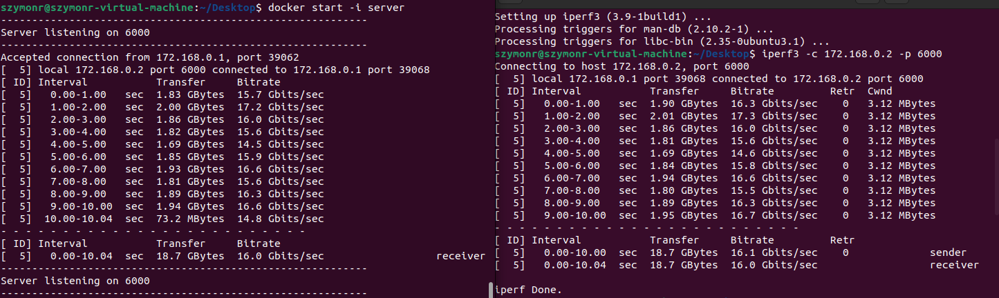

# Sprawozdanie LAB_04 - Dodatkowa terminologia w konteneryzacji, instancja Jenkins

## Przeprowadzenie buildu w kontenerze
### Zachowywanie stanu
1. Utworzenie woluminów poleceniem **docker crate volume** z nazwami **input_volume** oraz **output_volume**.
Oraz uruchomienie kontenera w trybie TTY, przy pomocy powłoki bin/bash ustawiając woluminy opcją 
**-v** (opcja "szybka", ma mniej funkcjonalności do **--mount**) poprzez przypisanie katalogów w /var/lib/docker/volumes 
na hoście do katalogu odpowiednio /input oraz /output na wirtualce -  w skrócie jest to mapowanie katalogów:  
  
  
2. Wszystkie potrzebne dependencje były już w kontenerze łącznie z make i git. Kolejno sklonowałem repo do
wskazanego przeze mnie katalogu (zgodnie z logiką podania katalogu przy uruchamianiu kontenera /input), czyli właśnie na
wolumin wyjściowy:  
  
3. Kolejno przejście do katalogu cd /input/nydus-snapshotter (domyślnie wchodząc przy pomocy powłoki ustawiony 
jest WORKDIR z wcześniej budowanego obrazu) i wykonanie **make**:  
  
4. Kolejno musiałem umieścić zaciągnięte repo w katalogu wyjściowym, co w tym wypadku jest równoważne poprostu z przekopiowaniem
go do folderu na wirtualce który jest zamontowany do volumina wyjściowego. Plik wynikowy komendy make to będzie plik binarny
znajdujący się w katalogu bin projektu (w przypadku Golanga):  
  
Sprawdzając zawartość katalogu output na wirtualce:  
  
Oraz zawartość katalogu na hoście:  
  
Wszystko się zgadza. Sama zawartość:  
  
Ostatecznie status volumina wyjściowego:
  

### Eksponowanie portu
Iperf3 to narzędzie używane do badania maksymalnej przepustowości sieci IP. 
Obsługuje dostosowywanie różnych parametrów związanych z czasem, buforami i protokołami (TCP, UDP, SCTP z IPv4 i IPv6).
Podaje w czasie realnym takie informacje jak: przepustowość, utratę pakietów, rozmiar bufora, czas trwania, itd.
1. Zaciągnąłem obraz "networkstatic/iperf3" z Docker Huba. Kolejno uruchomiłem server zgodnie z dokumentacją:
  
2. Kolejno połączyłem się na porcie 6000 jako klient. Widoczny jest przykładowy pomiar i przepływ pakietów:
 
3. Tworze sieć dockera przy pomocy tagów --network oraz dołączam się do servera poprzez rozwiązywanie nazw (podanie nazwy
nadanej i zrozumiałej przez człowiek w większym stopniu niż klasyczny adres IP jak w przypadku poprzedniego punktu):
   
Różnicy zbyt wielkiej nie ma w tym przypadku ponieważ tym samym był punkt poprzedni, defaultowo kontenery podłączone są 
do bridga, bez podawania żadnych parametrów sieci, tutaj mamy stworzoną własną sieć również na zasadzie bridge.
Wykorzystanie DNS do targetowania servera. Poniżej zamieszczam status mojej sieci - widoczne podłączenie dwóch kontenerów;
serwer oraz klient:  
   
4. Skonfigurowałem sieć jeszcze raz tym, zmieniajac więcej parametrów. Ustawiłem podsieć na adres z maską: --subnet=172.168.0.0/16 
podczas tworzenia sieci. Oraz dodałem adresy IP dla 172.168.0.2 oraz 172.168.0.3 dla kolejno sewera i klienta:  
  
Więc dla adresu serwera 172.168.0.2 i portu 6000 połączyłem się z hosta z konterem serweru iperf3:  
  
  
Niestety nie mam możliwości połączenia się z dockerem z innej sieci LAN (routing WAN) np przy pomocy VPN.
Zatem połącze się z serwerem iperf3 w obrębie tej samej sieci LAN, z drugiego komputera (tj z komputer, maszyny fizycznej, na której
zainstalowany jest setup maszyny wirtualnej w której istnieją systemy kontenerowe).
Połaczyłem się z maszyną wirtualną Ubuntu o IP 192.168.65.128 na porcie 6001. Kolejno odpaliłem kontener mapując port 
hosta z 6001 na 6002, który jest portem kontenera, który nasłuchuje właśnie na tym porcie:  
  
5. Wniosek płynący to jest ta rozbieżność wartości transferu, czyli ilości danych przesłanych do serwera oraz
rozbieżność w bitrate, czyli szybkość transmisji w jednostce czasu. Widoczny jest wyraźny spadek wartości transferu 
oraz prędkości przesyłu pakietów danych - kolejno około 18 i 16 krotne spadki. Ograniczona przepustowość łącza z uwagi
na wiele czynników wynikających z samej definicji architektury sieciowej.  

### Instancja Jenkins
Instalacja skonteneryzowanej wersji Jenkinsa z pomocnikiem DIND (Docker-in-Docker), zgodnie z dokumentacją: 
https://www.jenkins.io/doc/book/installing/docker/.  
- Pobranie odpowiednich obrazów:  
  
  
- Stworzenie Dockerfile i stworzenie kontenera zgodnie z dokumentacją:
```
FROM jenkins/jenkins:2.387.1
USER root
RUN apt-get update && apt-get install -y lsb-release
RUN curl -fsSLo /usr/share/keyrings/docker-archive-keyring.asc \
  https://download.docker.com/linux/debian/gpg
RUN echo "deb [arch=$(dpkg --print-architecture) \
  signed-by=/usr/share/keyrings/docker-archive-keyring.asc] \
  https://download.docker.com/linux/debian \
  $(lsb_release -cs) stable" > /etc/apt/sources.list.d/docker.list
RUN apt-get update && apt-get install -y docker-ce-cli
USER jenkins
RUN jenkins-plugin-cli --plugins "blueocean docker-workflow"

```
```
docker build -t myjenkins-blueocean:2.387.1-1 .
```
```
docker run --name jenkins-blueocean --restart=on-failure --detach ^
  --network jenkins --env DOCKER_HOST=tcp://docker:2376 ^
  --env DOCKER_CERT_PATH=/certs/client --env DOCKER_TLS_VERIFY=1 ^
  --volume jenkins-data:/var/jenkins_home ^
  --volume jenkins-docker-certs:/certs/client:ro ^
  --publish 8080:8080 --publish 50000:50000 myjenkins-blueocean:2.387.1-1
```

- Kolejno uruchomienie kontenera przy pomocy:  
```
docker exec -it jenkins-blueocean bash
```
- Następnie należało znaleźć hasło admina w logach:  
```
docker logs jenkins-blueocean
```
Następnie przejście przez konfiguracje Jenkinsa, konta administratora itd, finalnie konfiguracaj przebiegła pomyślnie:  


## Zakres rozszerzony tematu sprawozdania
### Komunikacja
Zadanie polegało na stworzeniu 2 kontenerów na podstawie 2 Dockerfile: base i build. "build" bazuje na kontenerze "base". 
Kontener "base" zaciąga repozytorium, builduje je i finalnie wysyła dane do wolumina o nazwie "shared_volume".

Dockerfile dla base_image:
```
FROM golang:latest
```

Dockerfile dla build_image:
```                                                        
FROM base_image:latest

WORKDIR /work
RUN git clone https://github.com/containerd/nydus-snapshotter.git .
RUN make build
VOLUME /volume
WORKDIR bin

#CMD ["cp", "-r", "container-snapshotter-grpc", "/volume"]
```
Następnie uruchomienie kontenera i przekopiowanie na volume:  
  
  

#### Opis:  
Chciałem zautomatyzować cały proces i wykorzystać wpierw polecenie RUN cp -r container-snapshotter-grpc /volume. Co nie 
zadziałało z uwagi na to że RUN wykonywane są podczas budowania kontenera. 
Kolejno próbowałem wstawić CMD lub ENTRYPOINT jak widać na powyższym skrypcie Dockerfile, jednakże tutaj ciągle zgłasza mi
że nie istnieje ścieżka do pliku. Nie wiem czy poprostu nie doczytałem czegoś w dokumentacji, ponieważ wydaje mi się że na
99% podaje poprawną ścieżkę w kontenerze.
Można było jeszcze spróbować uruchomić kontener w tle z opcją **-d**, a następnie wykonać: **docker exec build_cont cp -r work/bin/container-snapshotter-grpc /volume**.
Finalnie tak czy tak zadanie zostało zakończone pomyślnie.  

### Usługi w rozumieniu systemu, kontenera i klastra
Celem było zestawienie połączenia w koneterze SSHD - połączenie z kontenerem Ubuntu lub Fedora. Wybrałem Ubuntu.  
- Utworzyłem kontener ubuntu zgodnie z poleceniem:  
```
docker run -it --name ubuntu_ssh_server -p 2200:22 -d ubuntu:latest
docker exec -it ubuntu_ssh_server bash
```
- Następnie zainstalowałem openssh:  
```
apt install openssh-server
```
- Kolejno ustawiłem hasło roota:  
```
passwd root
```
Następnie instalacja edytora tekstowego oraz zmiana w folderze **sshd_config** na ścieżce **/etc/ssh**, dokładnie
zamiana opcji **'PermiRootLogin'** zgodnie z dokumentacją.  
  

Serwer SSH pracuje:  
  

Serwer działa - połączenie udane:
  

Połączenie na wyprowadzonym dla maszyny porcie równym 2200 (mapowanie portu 22). Połączenie zakończone sukcesem i 
dostęp do systemu kontenerowego ubuntu.

### Jenkins: zależności
1. Co jest potrzebne w Jenkinsie by uruchomić Dockerfile dla buildera?  
Przede wszystkim potrzebny jest tak zwany DIND (Docker in Docker), aby móc wykorzystywać Dockera w Jenkinsie, który 
przychodzi defaultowo bez takiego oprogramowania - jest to technologia umożliwiająca tak naprawde uruchomienie kontenera
Docker w innym kontenerze Docker. Kontener DIND zawiera samego Dockera jak i Docker Compose. Uruchamianie tego typu
kontenerów w kontenerach pozwala na budowanie i testowanie zamkniętych aplikacji różnego rodzaju w jednym izolowanym 
środowisku - to wszystko dzieję się w interfejsie Jenkinsa. Następnie należy utworzyć nowe zadanie, 
które będzie korzystać z Dockera jako narzędzia do budowania. 
Ostatecznie w konfiguracji zadania należy wybrać porządane opcje i podać ścieżkę do Dockerfile, który będzie budował obraz
zgodnie z podaną komendą.  
2. Co jest potrzebne w Jenkinsie by uruchomić Docker Compose?  
Analogicznie jak w punkcie 1 potrzeba zainstalować Docker Compose, kolejno wybrać zadanie, zaznaczyć porządane opcje, 
zdefiniować plik Docker Compose w rozszerzeniu .yml oraz finalnie podać polecenie do uruchomienia kompozycji.