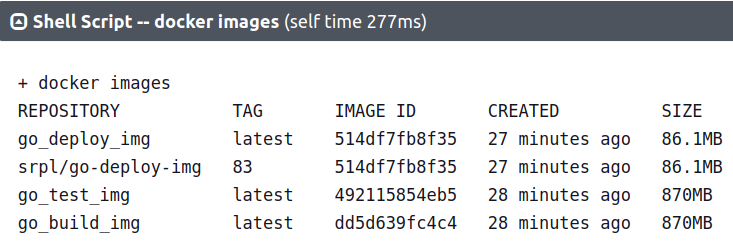

# Sprawozdanie LAB_05-07:
- Pipeline, Jenkins, izolacja etapów
- Pipeline: lista kontrolna
- Jenkinsfile: lista kontrolna

Szymon Rogowski (405244), AGH UST, WIMIIP Faculty

## Wstęp
### Opis aplikacji
Aplikacja wybrana do projektu jest inna niż do tej pory. Wcześniej korzystałem z snapshottera https://github.com/containerd/nydus-snapshotter
zaś obecenie wykorzystuje swój własny projekt - jest to aplikacja w postaci aplikacji webowej realizującej zadania serwera
REST API, napisanej w języku GO. Aplikacja to prosty kalkualtor realizujący najprostsze działania takie jak odejmowanie, 
dodawanie, dzielenie i mnożenie. Link do mojego projektu w GO: https://github.com/PsimonL/REST_API_calculator_for_Jenkins_pipeline.  
Składa się ona z następujacych plików:
- **main.go** jest driverem API, posiada jedyną funkcje będącą wrapperem dla requesta GET:
```
package main

import (
	// "encoding/json"
	"fmt"
	"log"
	"net/http"
)

func helloHandler(w http.ResponseWriter, r *http.Request) {
	fmt.Fprintf(w, "Hello, World!\n")
	fmt.Println("GET requested")
}

func main() {
	fmt.Println("REST API listening...")
	http.HandleFunc("/hello", helloHandler)
	http.HandleFunc("/add", addHandler)
	http.HandleFunc("/subtract", subtractHandler)
	http.HandleFunc("/multiply", multiplyHandler)
	http.HandleFunc("/divide", divideHandler)
	log.Fatal(http.ListenAndServe(":3001", nil))
}
```
- **calculator.go** który implementuje rządania POST, czyli funkcje kalkulatora:
- **validator.go** funkcja pomocnicza która waliduje czy zapytanie jest typem HTTP POST, następnie przechwytuje dane liczbowe.
- Oraz funkcja realizująca testy **main_test.go** (nazwa pliku z testami musi zaczynać się od pliku który będziemy testować,
kolejno konwencja nazewnictwa narzuca "_"), każda funkcja testuje inną metodą, są one analogiczne.

### Licencja
Oczywiście projekt GO należy do mnie natomiast  w przypadku użycia projektu cudzego należy sprawdzić czy posiada odpowiednie
licencje, głównie chodziło by tutaj o open-source, czyli licencje typu: MIT, Apache License 2.0, GNU General Public License (GPL) v2 i v3,
Creative Commons Licenses, itd.

### Działanie 
Oczywiście kod się kompiluje i działa poprawnie, można go przetestować przy użyciu skryptu Pytho, Bash, przy użyciu konsoli,
czy przykładowo oprogramowania PostMan i wiele innych, przykładowe działanie:


Oraz przykładowe testy również wszystkie przechodzą:


### Opis workflow CI/CD w postaci diagramu UML  
Wykonanie diagramu przy pomocy serwisu: https://www.lucidchart.com w bezpłatnym modzie.
Poniżej przedstawiam diagram Workflow CI/CD, z podziałem na fazy CI oraz CD:  
  
- CI, Continuous Integration - proces ciągłego wypychania kodu do repozytorium centralnego, budowania go, oceniania oraz mergowania tychże zmian
do mastera po pomyślnym przejściu wszystkich testów, które są uruchamiane automatycznie przez serwis utrzymujacy dany pipeline. 
- CD, Continuous Delivery - proces ciągłego wdrażania aplikacji do środowisk produkcyjnych, po zakończeniu procesu CI. 
Obejmuje to automatyzację procesów związanych z wdrożeniem aplikacji, takich jak testowanie, budowanie, dystrybucja 
i wdrażanie na serwery produkcyjne. Celem CD jest skrócenie czasu potrzebnego do wdrożenia nowych wersji aplikacji 
do środowisk produkcyjnych oraz zwiększenie pewności, że nowa wersja działa bez błędów. 

Podsumowując: CI to proces integracji i testowania kodu, a CD to proces automatycznego wdrażania do środowisk produkcyjnych.

## Opis Jenkins pipeline
Jenkins Pipeline to mechanizm pozwalający na definiowanie i zarządzanie procesami budowania, testowania i wdrażania 
aplikacji w Jenkinsie. Pipeline jest oparty na skrypcie i pozwala na definiowanie całego procesu w sposób deklaratywny, 
co ułatwia jego konfigurację i udostępnia możliwość przechowywania konfiguracji jako kod źródłowy.
Pipeline składa się z kilku etapów (stage), które definiują kolejne kroki w procesie budowania i wdrażania aplikacji. 
W każdym etapie mogą być wykonywane różne zadania, takie jak budowanie, testowanie, wdrażanie, czy też weryfikacja oprogramowania.
Jenkins Pipeline pozwala na automatyzację całego procesu CI/CD, co pozwala na szybsze i bardziej niezawodne dostarczanie 
aplikacji do produkcji. Dodatkowo, Pipeline udostępnia wiele narzędzi i rozszerzeń, które ułatwiają pracę z Jenkinsem, 
takie jak Blue Ocean, który dostarcza intuicyjny interfejs graficzny do zarządzania procesem Pipeline.  

Poniżej kolejno opisze najpierw dockerfile wykorzystane w procesie automatyzacji, a potem obudową w postaci skryptu Groovy,
który jest głównym zarządcą pipeline.

### Kontenery i Dockerfiles
#### Build
Dockerfile wykorzystany do budowy "builda" nazwałem **go_build**. Jego celem jest pobranie projektu GO i zbudowanie go
do postaci pliku binarnego. 
```
FROM golang:latest
WORKDIR /app
RUN apt-get update && apt-get install -y nano
RUN git clone https://github.com/PsimonL/REST_API_calculator_for_Jenkins_pipeline.git
WORKDIR /app/REST_API_calculator_for_Jenkins_pipeline
RUN go build -o REST_API_calculator_for_Jenkins_pipeline
EXPOSE 3001
CMD ["./REST_API_calculator_for_Jenkins_pipeline"]
# CMD ["bash"]
```

#### Test
Dockerfile o nazwie **go_test** jego celem zbudowanie testów i zwrócenie rezultatów tychże testów. Bazuje on bezpośrednio
na **go_build**.
```
FROM go_build_img
WORKDIR /app/REST_API_calculator_for_Jenkins_pipeline
CMD ["go", "test", "-v"]
#CMD ["bash"]
```

#### Deploy
Nazywa się **go_build**. Jego celem jest przygotowanie finalnego artefaktu pod wdrożenie - czyli w moim wypadku wybrałem
kontener, aplikacja pracująca jako kontener ponieważ dobrze się to sprawdza w przypadku aplikacji wystawiającej endpointy 
i pracującej w roli drobnego serwera, jest to wręcz zalecane. Ale oczywiście nie trzeba wykorzystywać kontenera, można 
przedstawić Deploy w postaci innego przenośnego formatu, np. archiwum, (DEB/RPM/TAR/JAR/ZIP/NUPKG). Dockerfile Deploy
kopiuje plik binarny z kontenera Jenkinsa (DIND) oraz wystawia port 3001 na której zachodzi komunikacja z API.
```
FROM ubuntu:latest
WORKDIR /app
RUN apt-get update && \
    apt-get install -y nano && \
    rm -rf /var/lib/apt/lists/*
COPY REST_API_calculator_for_Jenkins_pipeline /app/REST_API_calculator_for_Jenkins_pipeline
EXPOSE 3001
CMD ["./REST_API_calculator_for_Jenkins_pipeline"]
# CMD ["/bin/bash"]
```

### Konfiguracja Jenkins
Pierwszym krokiem jest konfiguracja Jenkinsa, aby to zrobić należy podążać zgodnie z dokumentacją:
https://www.jenkins.io/doc/book/installing/docker/#setup-wizard
Czego efektem działania jest praca dwóch kontenerów:  

Interfejs Blue Ocean jest dostępny na porcie 127.0.0.1:8080 - daje nam to dostęp do kontenera DIND Jenkinsa, w postaci 
przyjemnego GUI:  
  

Projekt który zawiera Dockerfile i jest pobierany na kontener Jenkinsa (DIND) to: 
"https://github.com/InzynieriaOprogramowaniaAGH/MDO2023_INO.git/"

Należało wpierw skonfigurować pluginy (między innymi Dockera czy GitHuba), które można pobrać:  
```
Dashboard   >   Manage Jenkins   >   Plugin Manager
```
Ważnym elementem również było konfiguracja Credentialy Jenkinsa do połączenia z DockerHubem, co umożliwia bezpieczeństwo danych
i nie zawieranie "fragile data" w produkcie. Aby tego dokonać należy znaleźć w interfejsie graficznym Blue Ocean ścieżkę:
```
Dashboard   >   Manage Jenkins   >   Credentials   >   Domains: (global)   >   Add Credentials
```
W momencie dodawania nowego Credentiala należało wybrać opcje:
- Kind: Username with password
- Scope: Global (Jenkins, nodes, items, all child items, etc)
- Username - wpisanie swojej nazwy użytkownika z Githuba
- Password - tutaj należy wkleić Acces Token, który należy wygenerować na koncie DockerHub, znajduje się on:
```
User widget (right-upper corner)   >   Account Settings   >   Security   >   New Access Token
```
- ID - wpisanie ID credentiala, dzięki tej zmiennej można odwoływać się do ustaloneog credentiala poprzez nazwę
zmiennej środowiskowej
- Description - opcjonalny opis, natomiast zalecany, czym jest zdefiniowany credential
Poniżej link do tutoriala:  
https://www.youtube.com/watch?v=alQQ84M4CYU&t=181s  

Kolejno dodajemy **nowego Joba** z poziomu Dashboarda:
```
Dashboard   >   New Item   >   Pipeline
```

### Opis skryptu - Groovy
Ogólna struktura skryptu opisującego pipeline. 
- **agent any** to instrukcja, która określa, że dany etap (stage) pipeline powinien być wykonywany 
na dowolnym dostępnym w Jenkins agencie. 
- **environment** to sekcja w skrypcie która określa zmienne środowiskowe skryptu w Groovym.
- **stages** to sekcja gdzie znajdują się kolejne etapy "rurociągu".
Architektura pipeline:
```
pipeline{
    agent any
    environment {
        DOCKER_BUILD_DIR = 'INO/GCL2/SR405244/Lab05-07'
        REPO_NAME = 'MDO2023_INO'
        def version = sh (script: 'echo ${BUILD_NUMBER}', returnStdout: true).trim()
    }

    stages {
        stage('Cleanup') {
            steps{ script{ } }
        }
        
        stage('Build') {
            steps { script { } }
        }
        
        stage('Test') {
		    steps { script { } }
	    }
	    
         stage('Deploy') {
		    steps { script { } }
	    }
	    
	    stage('Publish') {
		    steps { script { } }
	    }
	      
    }
}

```
#### Stage Clean
Stage który **czyści przestrzeń kontenerów i obrazów** usuwając je, ponieważ po skończym pipeline, kontenery które są budowane 
na podstawie dockerfiles **zostają po zakończeniu działania skryptu** w systemie kontenerowym Jenkins (DIND). 
```
stage('Cleanup') {
            steps{
                script{
                    sh 'echo "Start Cleanup"'
                    // sh 'docker container stop go_deploy_cont'
                    sh 'docker container prune --force'
                    sh 'docker image prune --all --force'
                    sh 'docker container ls -a'
                    sh 'docker images'
                    sh 'echo "Cleanup finished"'
                }
            }
        }
```
#### Stage Build
**Można było również umieść stage np.: "Pull" do zaciągnięcia repozytorium kodu, jednakże ja umieściłem ten etap w 
etapie "Build" aby podkreślić, że repozytorium jest zaciągane tylko jednokrotnie właśnie w tym etapie - etapie Build.**  
Poniższy etap klonuje repozytorium gdzie znajdują się ważne pliki między innymi Dockerfiles. Kolejno przechodzę do katalogu,
zmieniam brancze na swoją, uruchamiam budowanie obrazu Build oraz **kopiuje powstały plik binarny na hosta** - w tym wypadku
kontener Jenkinsa (DIND).
```
stage('Build') {
            steps {
                script {
                    sh 'echo "Start Build"'
                    sh "rm -rf *"
                    sh "git clone https://github.com/InzynieriaOprogramowaniaAGH/MDO2023_INO.git"
                    dir('MDO2023_INO') {
                        sh "pwd"
                        sh "ls -la"
                        sh "git branch -a "
                        sh "git checkout SR405244" 
                        sh "docker build -t go_build_img -f ${DOCKER_BUILD_DIR}/go_build ${DOCKER_BUILD_DIR}"
                        sh 'docker run -d --name go_build_cont go_build_img'
                        sh 'docker cp go_build_cont:/app/REST_API_calculator_for_Jenkins_pipeline/REST_API_calculator_for_Jenkins_pipeline /var/jenkins_home/workspace/API_calc_pipe/MDO2023_INO'
                        sh 'docker stop go_build_cont'
                        sh 'docker rm -f go_build_cont'
                        sh 'docker container ls -a'
                        sh "ls -la"
                    }
                    sh 'echo "Build finished"'
                }
            }
        }
```
#### Stage Test
W tym etapie również buduje obraz Test i uruchamiam jego instancje (kontener). Uruchomienie jest konieczne ponieważ
komenda CMD odpala nam testy. Kolejno **zbieram wyniki testów** do pliku **test_logs.txt** oraz **sprawdzam czy wszystkie
przeszły** w postaci instrukcji warunkowej, jeśli warunek zostanie spełniony i zostanie znaleziony "FAIL" to proces 
"rurociągu" zostaje wyłączony w tym momencie.
```
stage('Test') {
		    steps {
		        script {
		          sh 'echo "Start Test"'
		            dir('MDO2023_INO') {
		                sh 'docker build -t go_test_img -f ${DOCKER_BUILD_DIR}/go_test ${DOCKER_BUILD_DIR}'
		                sh 'docker container ls -a'
		                sh 'docker run --name go_test_cont go_test_img'
		                sh 'echo "Below logs for tests:\n" > test_logs.txt'
                        sh 'docker logs go_test_cont >> test_logs.txt'
                        sh 'cat test_logs.txt'
                        archiveArtifacts 'test_logs.txt'
                        sh 'docker stop go_test_cont'
                        sh 'docker rm -f go_test_cont'
                        def test_logs = readFile 'test_logs.txt'
                        if (test_logs.contains('FAIL')) {
                            error 'Tests failed, cannot proceed with the pipeline processes!'
                        }
		            }
		          sh 'echo "Test finished"'
		        }
		    }
	    }
```
#### Stage Deploy
W tym etapie **pobieram plik binarny zbudowany w etapie Build**, pobieram go z hosta, w tym wypadku kontenera Jenkins (DIND).
**Zamykam plik binarny będący owocem pracy Build w postaci kontenera**, co jest finalnym artefaktem projektu "rurociągu" Jenkinsa.  

**Ważne:**  
W zakomentowanej sekcji próbowałem jeszcze raz przeprowadzić testy, które zostały napisane w Bash, **test_GET.sh** oraz
**test_POST.sh** (które znajdują się w repozytorium), tak aby napisać drobne post-deploy tests. Jednakże nie byłem wstanie odpalić skryptów Bash na 
kontenerze DIND Jenkins, z niewiadomych mi przyczyn. W konsoli otrzymywałem wynik, że:  
"+ MDO2023_INO/INO/GCL2/SR405244/Lab05-07/test_GET.sh
/var/jenkins_home/workspace/API_calc_pipe/MDO2023_INO@tmp/durable-5283bbb4/script.sh: 1: MDO2023_INO/INO/GCL2/SR405244/Lab05-07/test_GET.sh: not found"
Mimo, iż wykonuje tą komendę będąc w poprawnym katalogu, który posiada te skrypty (wcześniej sprawdzone - sh 'ls -la').
Wydaje mi się, że jest tu problem stricte z środowiskiem DIND Jenkins, ponieważ jest ono postawione z tego co wyczytałem 
bodajże na Linux Alpine, musiałbym się jeszcze bardziej zagłębić w dokumentację i poświęcić sporo więcej czasu na poprawne 
skonfigurowanie (sudo, apt-get, curl, apk add nie są zawarte w obrazie, nie jestem wstanie pobrać niczego ponieważ non-stop 
wyrzuca "Permission denied"), zatem postanowiłem narazie to zostawić z uwagi że **jest to cel wymyślony przeze mnie**, który
nie jest zawarty w krokach laboratorium, z zamysłem poprawy w przyszłości w własnym zakresie.
```
stage('Deploy') {
          steps {
            sh 'echo "Start Deploy"'
            script {
              dir('MDO2023_INO') {
                sh "docker build -t go_deploy_img:latest -f ${DOCKER_BUILD_DIR}/go_deploy ${DOCKER_BUILD_DIR}"
                sh "docker run -d -p 3001:3001 --name go_deploy_cont go_deploy_img:latest"
                sleep(5)
                sh "docker logs go_deploy_cont"
                sh "docker ps -a"
                sh "ls -a"
                // // Doesn't respond at pipeline stage but works perfectly fine as pulled image from DockerHub
                // sh 'sudo apt-get update'
                // sh 'sudo apt-get install wget -y'
                // sh 'curl http://localhost:3001/hello'
                // sh 'wget --header="Content-Type: application/json" --post-data="[5, 1]" http://localhost:3001/add'
                //// Also doesn't see files even if they exist in directory 
                // dir("/INO/GCL2/SR405244/Lab05-07/"){
                //     sh "ls -a"
                //     sh "pwd"
                //     sh "bash test_GET.sh > test_post_logs.txt"
                //     sh "bash test_POST.sh >> test_post_logs.txt"
                //     def test_post_logs = readFile 'test_post_logs.txt'
                //     if (test_post_logs.contains('FAIL')) {
                //         error 'Tests failed, cannot proceed with the pipeline processes!'
                //     }
                // }
                // sh 'cat test_post_logs.txt'
                // archiveArtifacts 'test_post_logs.txt'
                
                sh "docker container stop go_deploy_cont"
                sh "docker container rm -f go_deploy_cont"
              }
            }
            sh 'echo "Deploy finished"'
          }
        }
```
#### Stage Publish
Ten etap, ostatni, jest odpowiedzialny jedynie za wysłanie finalnego artefaktu. Postać takiego artefaktu jest dowolona jednakże,
najlepszym i najskuteczniejszym sposobem jest publikacja w postaci aplikacji ujętej w kontener do jakiegoś zewnętrznego 
rejestru online - w moim przypadku jest to Docker Hub. **Wykorzystuje credentiale skonfigurowane dla Docker Huba**. 
Proces konfiguracji został opisany wcześniej w podpunkcie "Konfiguracja Jenkinsa". Ważnym aspektem jest tutaj odpowiednie
mapowanie portów w procesie buildowania i uruchamiania konteneru. Ja wykorzystałe port 3001 - **EXPOSE 3001** oraz 
**docker run -it -p 3001:3001 --name my_cont srpl/go-deploy-img:83**  
```
stage('Publish') {
            steps {
                    sh 'echo "Start Publish"'
                    withCredentials([usernamePassword(credentialsId: 'my-dockerhub', usernameVariable: 'DOCKER_USERNAME', passwordVariable: 'DOCKER_PASSWORD')]) {
                        script {
                            sh 'echo "Start Publish"'
                            sh 'docker images'
                            // sh 'docker login -u $DOCKER_USERNAME --password-stdin' // cannot perfomr on not TTY device
                            sh 'docker login -u $DOCKER_USERNAME -p $DOCKER_PASSWORD'
                            sh 'docker tag go_deploy_img:latest $DOCKER_USERNAME/go-deploy-img:${version}'
                            sh 'docker push $DOCKER_USERNAME/go-deploy-img:${version}'
                            sh 'docker images'
                        }
                    }
                    sh 'echo "Publish finished"'
                } 
        }
```
Weryfikacja poprawności działania "rurociągu":  
  

### Artefakt logów testowych - stage Test
Przy pomocy wywołania polecenia **docker logs** uzyskuje wyniki testów, które kolejno wysyłam do pliku tekstowego przy pomocy
strumieniowania **>** oraz **>>**. Logi zostają zapisane w postaci artefaktu, który zawiera plik .txt o nazwie **test_logs.txt**.  
  
Zawartość pliku - wszystkie testy przechodzą:  
    
Sprawdzam również czy w pliku **.txt** wszystkie testy przeszły, jeśli nie to zwracany jest **exit-cod**e równy **1**, **co kończy
działanie pipeline natychmiastowo**.

### Wersjonowanie oraz test działania finalnego artefaktu - stage Deploy i Publish
- Wersjonowanie:
Z definicji: "Wersjonowanie artefaktu to proces przypisywania unikalnych identyfikatorów (numerów wersji lub kodów) do 
plików wynikowych (artefaktów), które są generowane w trakcie procesów wytwarzania oprogramowania.". 
Proces wersjonowania artefaktów jest bardzo ważny w procesie wytwarzania oprogramowania, 
ponieważ pozwala na łatwe identyfikowanie, śledzenie i zarządzanie różnymi wersjami plików, co ułatwia procesy wdrażania 
i utrzymania aplikacji. Umożliwia utrzymanie odpowiednich wersji oprogramowania i łatwiejszego łączenia różnych bibliotek 
i dependencji w funkcjonalne oprogramowanie - rozbieżność wersji często uniemożliwia wykorzystanie zaimplementowanych
"ficzerów" ponieważ przykładowo została zmienioa budowa klas czy funkcji. 
Typowe artefakty, które są wersjonowane, to pliki binarne, biblioteki, moduły, skrypty, konfiguracje, dokumentacje, 
czy kontenery -  tak jak w moim wypadku. Każdy artefakt powinien mieć przypisaną unikalną nazwę i numer wersji, 
który jest aktualizowany z każdą nową wersją artefaktu.

**Nomenklatura wersjonowania** jest raczej dowolna, przeważnie stosuje się 3 cyfry, oddzielone kropkami np: 1.2.3  
Natomiast ja uznałem że chodzi o sam fakt i poprostu dodałem tag do obrazu w postaci numeru buildu całego pipeline,
co jest definiowane przez zmienną środowiskową w następujący sposób:
```
def version = sh (script: 'echo ${BUILD_NUMBER}', returnStdout: true).trim()
```
Kolejno ta zmienna jest wywoływana przy tagowaniu finalnych obrazów:
```
sh 'docker tag go_deploy_img:latest $DOCKER_USERNAME/go-deploy-img:${version}'
sh 'docker push $DOCKER_USERNAME/go-deploy-img:${version}'
```

    

- Weryfikacja działania finalnego artefaktu:
Zaciągnięcie artefaktu:  
   
Weryfikacja lokalnego repozytorium Docker dla artefaktu:  
  
Działanie samo w sobie po stronie aplikacji i klienta:
  
  

### Dostepność artefaktu
**Zwersjonowany artefakt został opublikowany do rejestru online** w postaci DockerHub: https://hub.docker.com/u/srpl


Artefakt jest dostępny publicznie i jest możliwe pobranie obrazu z repozytorium DockerHub:
```
docker pull srpl/go-deploy-img:83
```

## Podsumowanie i porównanie z diagramem UML
Myślę, że wszystkie kroki zostały zrealizowane poprawnie i zgodnie z podanymi instrukcjami. Również diagram workflow
zostały zrealizowany dokładnie z pierwotnymi zamierzeniami, jednakże myślę że wynika to z mojego doświadczenia w temacie.

Myślę, że mogłem bardziej dostosować sposóv enumeracji kolejnych wersji zgodnie z powszechnie stosowaną nomenklaturą 
i przyjętymi standardami, dodając do tego również date wypuszczenia wersji, przykładowo: 2023.30.04.1.0.83

Natomiast zostały spełnione warunki "Definition of done":
Zatem, proces jest skuteczny, ponieważ "na końcu rurociągu" powstaje możliwy do wdrożenia artefakt (deployable).
- Czy opublikowany obraz może być pobrany z Rejestru i uruchomiony w Dockerze bez modyfikacji 
(acz potencjalnie z szeregiem wymaganych parametrów, jak obraz DIND)? - tak bez problemu, nie jesy wymagany również obraz DIND
bowiem mój finalny artfefakt pracuje niezależnie, oczywiście na hoście który chciałby skorzystać z takowego artefaktu finalnego
wymagane jest środowisko Dockera, aby uruchomić obraz, chociaż można oczywiście pobrać obraz i wyciągnąć z niego aplikacje.
- Czy dołączony do jenkinsowego przejścia artefakt, gdy pobrany, ma szansę zadziałać od razu na 
maszynie o oczekiwanej konfiguracji docelowej? - tak, jeśli ta konfiguracja posiada skonfigurowane środowisko konteneryzacji.  


**Wszystkie pliki wykorzystane w procesie tworzenia projektu zostały załączone w repozytorium**:
"https://github.com/InzynieriaOprogramowaniaAGH/MDO2023_INO/blob/SR405244/INO/GCL2/SR405244/Lab05-07"
