# Sprawozdanie LAB_08:
- Automatyzacja i zdalne wykonywanie poleceń za pomocą Ansible

Szymon Rogowski (405244), AGH UST, WIMIIP Faculty

## Instalacja zarządcy Ansible
1. Utworzenie kolejnej maszyny wirtualnej, konkretnie Fedora, o jak najmniejszym zbiorze oprogramowania: https://fedoraproject.org/pl/server/download/
Kolejno wybranie opcji pobierania: **Fedora Server 38 Netboot iso**:   
  
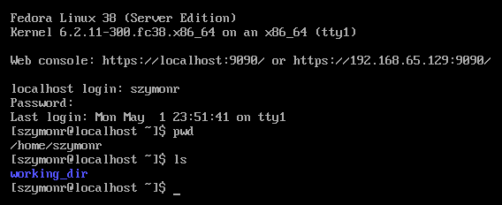  

2. Instalacja Ansible zgodnie z dokumentacją dla systemu Fedora: https://docs.ansible.com/ansible/2.9/installation_guide/intro_installation.html#installing-ansible-on-rhel-centos-or-fedora  
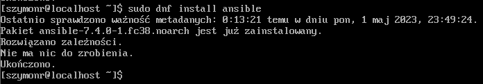  

3. Inwentaryzacja systemów - hostnamectl status, hostname -I / ip addr / ifconfig
- ustawienie przewidywalnych nazw węzłów przy pomocy **sudo hostnamectl set-hostname <node-name>**, gdzie **hostnamectl**
to narzędzie wiersza poleceń w Linux OS, które umożliwia zarządzanie nazwą hosta systemu - dzięki niemu można ustawić 
nazwę hosta, zmienić ją, ustawić aliasy oraz wyświetlić informacje o nazwie hosta.  
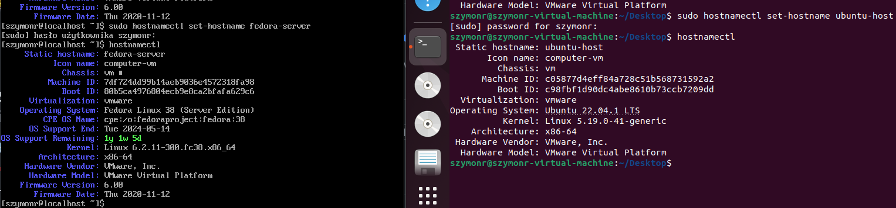  
- ustawienie nazw systemu DNS dla hosta ubuntu, poprzez usługę **systemd-resolved** lub plik konfiguracyjny **resolv.conf**, 
który określa serwery DNS, z których ma korzystać używany system w celu rozwiązywania nazw DNS. Oba z tych sposobów:
1. **systemd-resolved** -  usługa w Linux OS, która rozwiązuje nazw DNS, poprzez klasyczne mapowanie adresów IP na 
nazwy hostów (literalne) i na odwrót. Najpierw należało pobrać paczki usługi:  
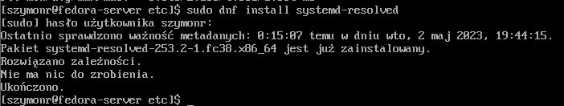  
Kolejno należało uruchomić usługę oraz ustawić ją jako domyślny resolver (druga linijka):  
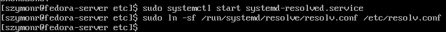  
Następnie w pliku **/etc/systemd/resolved.conf** należało wpisać IP wewnętrzne hosta/hostów z którymi chcemy się połączyć
przy pomocy DNS:  
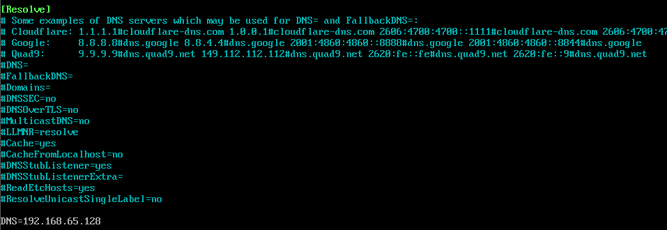  
Finalnie należało zrestartować usługę z zapisanymi hostami, ponad to potem sprawdzam czy połączenie może zostać nawiązane
przy pomocy komendy **ping**:  
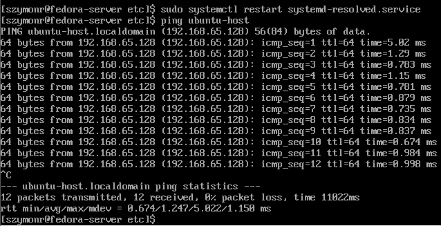  
2. **resolv.conf** - lub też wystarczyło wejść do pliku resolv.conf, dodając IP serwera według standardu: **nameserver <addr_IP>**.
Wcześniej należało również dodać prawa dostępu do pliku - **chmod u+w resolv.conf**:  
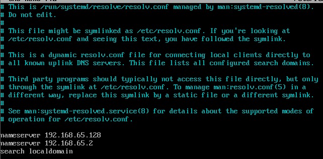  

4. Następnie należało stworzyć plik inwentaryzacji wedle dokumentacji: https://docs.ansible.com/ansible/latest/getting_started/get_started_inventory.html  
Plik został stworzony w formacie **.yaml** i ma strukturę, w domyśle jest on uruchamiany na "dyrygencie", hoście centralnym
zarządzajcym strukturą systemów związanych przez Ansible. Kolejno w zakładce **hosts** znajdują się pozostałe maszyny wirtualne.
5. 
6. Zanim sprawdzę łączność pomiędzy hostami przy pomocy polecenia **ping**, należy skonfigurować połączenie SSH między hostami,
a zarządcą, aby Ansible mógł wogóle działać na tychże hostach. Konfiguracja kluczy SSH, która polega na wygenerowaniu kluczy RSA
przy pomocy komendy **ssh-keygen**, która domyślnie zapisuje klucz publiczny i prywatny w domyślnym katalogu **/home/<user_name>/.ssh*
Kolejno należało skopiować klucz publiczny na docelowego hosta przy pomocy polecenia **ssh-copy-id ubuntu-host**,
co kopiuje klucz publiczny do pliku **/home/szymonr/.ssh/authorized_keys** oraz zweryfikować jego działanie:  
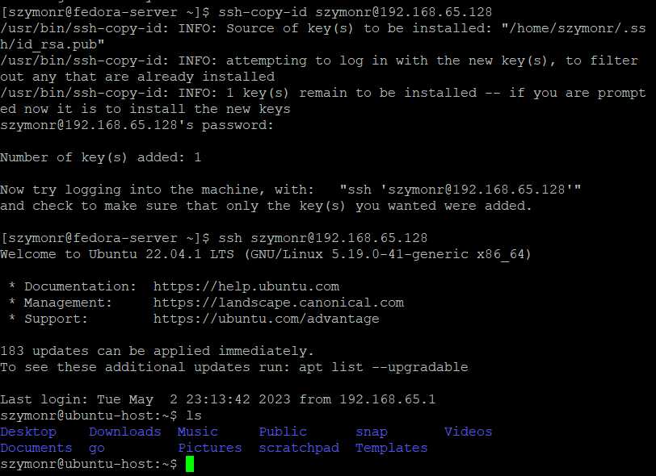

6. Finalnie tworzymy plik inwentaryzacji, w rozszerzeniu **.yaml** (można było również wykorzystać rozszerzenie **.ini**);
Pierwotna struktura pliku:
```
# File should be used at control node aka "orchestrator"
virtualmachines:
  hosts:
    vm01:
#      ansible_host: 192.168.65.128
      ansible_host: ubuntu-host
#    vm02:
#      ansible_host: centos-host
```

Po uwzględnieniu sekcjie "Orchestrators" oraz "Endpoints", widoczne jest również źe korzystam z resolvera DNS, gdzie:
- orchestrators -> lista serwerów zarządzających infrastrukturą
- endpoints -> lista hostów, na których chcemy wykonywać zadania za pomocą Ansible
- virtualmachines -> zawiera konfigurację maszyn wirtualnych, które chcemy zarządzać za pomocą Ansible

```
orchestrators:
  hosts:
    central-node:
      ansible_host: fedora-server

endpoints:
  hosts:
    node1:
      ansible_host: ubuntu-host

virtualmachines:
  hosts:
    vm01:
      ansible_host: ubuntu-host
```
Finalnie poleceniem **ansible virtualmachines -m ping -i inventory.yaml** rozsyłamy pakiety protokołu **ICMP** przy pomocy polecenia
**ping**, czyli protokołu diagnostycznego, który służy do monitoringu oraz raportowania o błędach w sieci teleinformatycznych np błędne adresy, 
problemy z dostępnością hosta, błędy w routingu, etc - ale również do określania parametrów sieci, 
takich jak maksymalny rozmiar paczki, czas życia pakietu (TTL), etc. ICMP można również wykorzystać w postaci innego narzędzia
np. traceroute czy pathping.  
W tym konkretnym wyniku wykonujemy polecenie ping na wszystkich hostach z grupy. Został zwrócony poprawny rezultat 
(dla polecenia "ping" zwrócono "pong":), co oznacza że połączenie jest poprawne i host jest gotowy do działania.
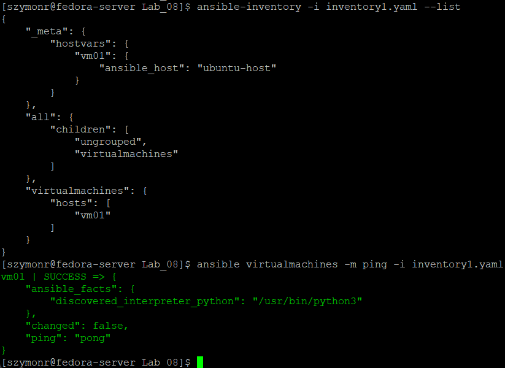  

## Zdalne wywoływanie procedur
1. Ponowne wysłanie polecenia **ping** opisanego powyżej do wszystkich maszyn z kategorii "Endpoints":  
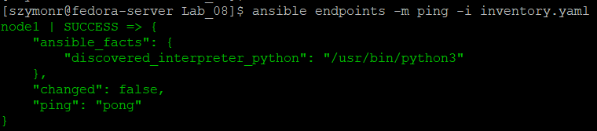  
2. Kopia pliku inwentaryzacji na węzły podrzędne do dyrygenta - w ciele komunikatu widoczne takie informacje jak;
gid (identyfikator grupy właściciela na docelowym węźle), group (nazwa grupy właściciela), owner (nazwa właściciela), 
mode (prawa dostępuna węźle docelowym, ustawiony w formacie szesnastkowym), itd:  
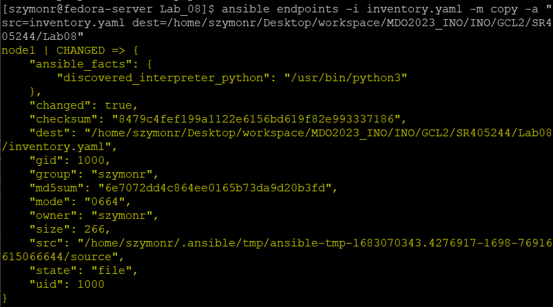  
Kopiowanie zakończone sukcesem:  
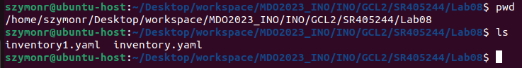  
3. Przeprowadź operacje względem maszyny z wyłączonym serwerem SSH, odpiętą kartą sieciową:  
Najpierw wyłączyłem SSH:  
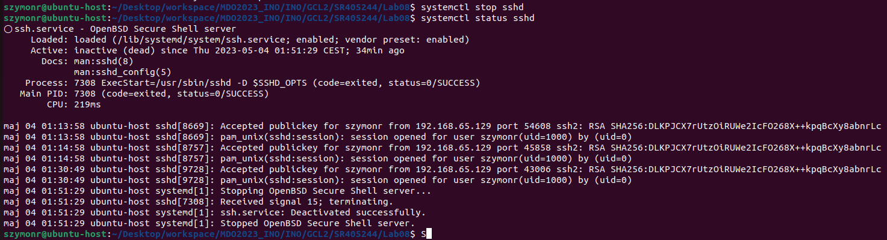     
Aby przesłać plik bez klienta SSH, należało by użyć protokołów takich jak FTP lub FTPS (FTP szyfrowane SSL/TSL). Aby
to zrobić należy wpierw otworzyć porty 20 i 21 natywne dla protokołu FTP na firewallu, czy też 989 i 990 dla FTPS.   
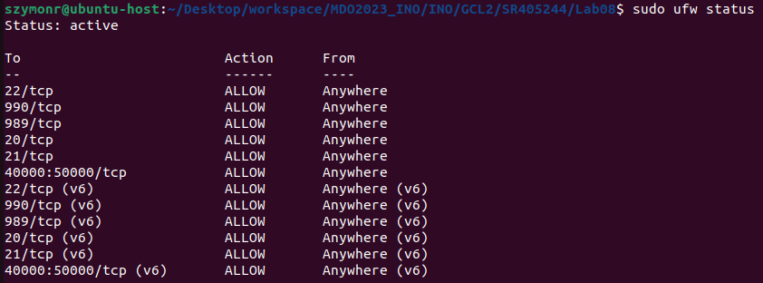   
Kolejno po zainstalowaniu FTP i FTPS na maszynach wirtualnych należało uruchomić jednego z nich. Tu pojawił się problem
ponieważ nie byłem wstanie tego zrobić - jakakolwiek próba połączenia kończyła się "connection timed out". Wpierw pomyślałem
że to porty, jednakże są one otwarte. Próbwałem rówież wykorzystać vsftpd ("very secure FTP daemon"), czyli bardzo popularny serwer 
FTP (File Transfer Protocol) używany na systemach OS Linux. Jednakże nic to nie zmieniło - zawiesznie konsoli 
"227 Entering Passive Mode (192,168,65,128,73,121).", po czym wyrzucało "zbyt długi czas oczekiwania".  

**NOTES:**
```
Problem z FTP występował z powodu kwesti związanych z SELinux.
```

Kolejno próbowałem zmienić pliki konfiguracyjne:
```
sudo nano /etc/vsftpd.conf
```
Upewniając się że wedle dokumentacji ustawione są zmienne:  
anonymous_enable=NO   # wyłączenie anonimowego logowania
local_enable=YES      # włączenie logowania lokalnych użytkowników
write_enable=YES      # włączenie możliwości zapisywania plików
chroot_local_user=YES # blokada użytkowników w ich katalogach domowych  

Co również nie pomogło. Postanowiłem zatem chwilo wyłączyć firewalla:
```
szymonr@ubuntu-host:~/Desktop/workspace/MDO2023_INO/INO/GCL2/SR405244/Lab08$ sudo ufw disable
Firewall stopped and disabled on system startup
szymonr@ubuntu-host:~/Desktop/workspace/MDO2023_INO/INO/GCL2/SR405244/Lab08$ sudo ufw enable
Firewall is active and enabled on system startup
szymonr@ubuntu-host:~/Desktop/workspace/MDO2023_INO/INO/GCL2/SR405244/Lab08$ sudo ufw status
Status: active

To                         Action      From
--                         ------      ----
22/tcp                     ALLOW       Anywhere                  
990/tcp                    ALLOW       Anywhere                  
989/tcp                    ALLOW       Anywhere                  
20/tcp                     ALLOW       Anywhere                  
21/tcp                     ALLOW       Anywhere                  
40000:50000/tcp            ALLOW       Anywhere                  
22/tcp (v6)                ALLOW       Anywhere (v6)             
990/tcp (v6)               ALLOW       Anywhere (v6)             
989/tcp (v6)               ALLOW       Anywhere (v6)             
20/tcp (v6)                ALLOW       Anywhere (v6)             
21/tcp (v6)                ALLOW       Anywhere (v6)             
40000:50000/tcp (v6)       ALLOW       Anywhere (v6)             
```

Wyłączenie firewalla pomogło na tyle że byłem wstanie się wogóle połączyć i zalogować na system Ubuntu, jednakże tutaj skolei
pojawił się problem z dostepnością do pliku? Mimo iż prawa do pliku są ustawione na 777 - próbowałem zarówno dla FTP jak i FTPS.
Widoczne są również pełne prawa dostępu do pliku:  
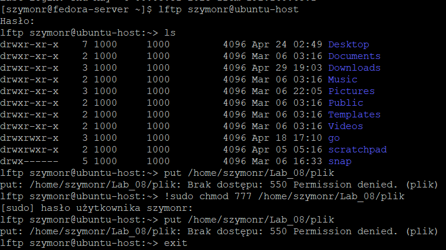     
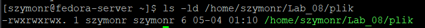     

Myślę że jest tu jakiś problem z domyślną konfiguracją serwera FTP ale nie jestem wstanie tego zlokalizować, gdzie dokładnie występuje
problem zwłaszcza, że zmieniłem plik konfiguracyjny klienta vsftpd **/etc/vsftpd.conf**.

## Zarządzanie kontenerem
1. Uruchamiam obraz i kontener na podstawie dockerfile **go_deploy**, wedle playbooka napisanego w 
**create-img-cont-deploy.yaml**, wyprowadzenie mapowania portów na 3002:3002:    
```
- name: Build and Run docker container based on go_deploy at ubuntu-host
  hosts: virtualmachines
  tasks:
    - name: Build Docker image
      docker_image:
        source: build
        build:
          path: /home/szymonr/Desktop/workspace/MDO2023_INO/INO/GCL2/SR405244/Lab05-07/
          dockerfile: go_deploy
        name: go_deploy_img
        tag: latest
      delegate_to: ubuntu-host

    - name: Run Docker container
      docker_container:
        name: go_deploy_cont
        image: go_deploy_img
        ports:
          - 3002:3002
```
Wynik działania polecenia **ansible-playbook -i inventory.yaml create-img-cont-deploy.yaml**:    
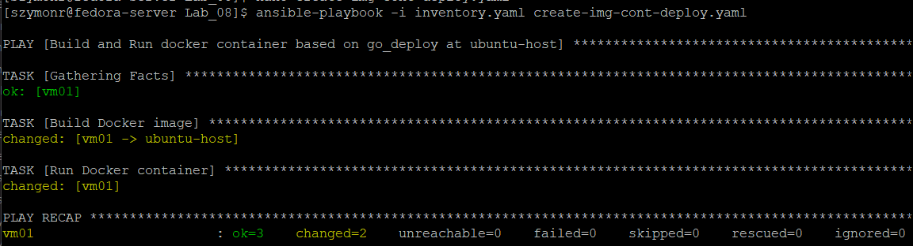   
Sprawdzenie na **ubuntu-host**:    
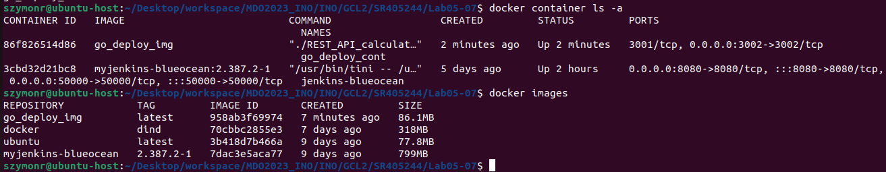   

2. Pobranie opublikowanego obrazu na DockerHubie i wykonanie uruchomienie kontenera na podstawie pobranego obrazu z wyprowadzeniem
portu 3001:3001:    
```
- name: Create container
  hosts: virtualmachines
  tasks:
    - name: Pull the srpl/go-deploy-img:91 image from DockerHub
      docker_image:
        name: srpl/go-deploy-img
        source: pull
        tag: 91

    - name: Create a container from srpl/go-deploy-img:91 image
      docker_container:
        name: go-deploy-cont
        image: srpl/go-deploy-img:91
        ports:
          - "3001:3001"
        detach: true
```
Wynik działania polecenia **ansible-playbook -i inventory.yaml pull-go-deploy.yaml**:  
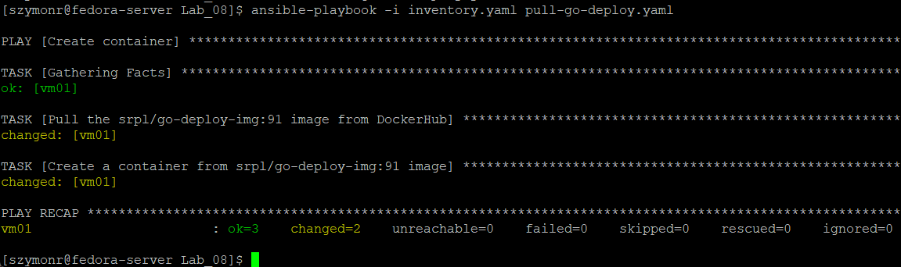  
Sprawdzenie na **ubuntu-host**:  
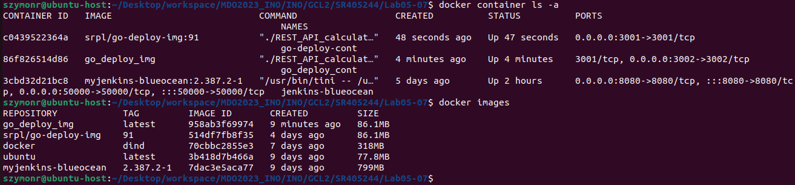  

3. Finalnie przykładowe usunięcie kontenera oraz obrazu, w tym wypadku na podstawie dockerfile go_deploy, obraz pobranego 
artefaktu DockerHuba oraz pracujacy kontener jego instancji o wyprowadzonym porcie 3001 nadal działa:  
```
- name: Cleanup Docker container and image of go_deploy dockerfile
  hosts: vm01
  become: true

  tasks:
  - name: Stop and remove Docker container
    docker_container:
      name: go_deploy_cont
      state: stopped
      state: absent

  - name: Remove Docker image
    docker_image:
      name: go_deploy_img
      state: absent

```
Wynik działania polecenia **ansible-playbook -i inventory.yaml cleanup.yaml --ask-become-pass** - konieczne podanie hasła
dla polecenia **sudo** aby uzyskać chwilowe uprawnienia roota:    
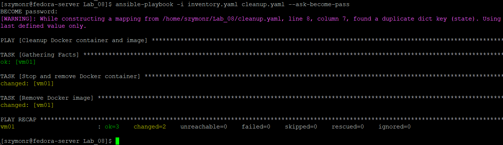   
Sprawdzenie na **ubuntu-host**:    
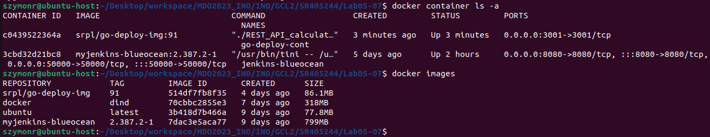   

Wszystkie kroki zdalnej pracy na kontenerach zostały zrealizowane poprawnie, wszystko działa wedle zamysłu.
Rzecz jasna można było jeszcze bardziej zautomatyzować proces poprzez ustawienie zmiennych środowiskowych czy ujęcia skryptów
Pythona do przykładowo web scrappowania ostatniego tagu obrazu na DockerHubie zamiast wpisywania go ręcznie.
