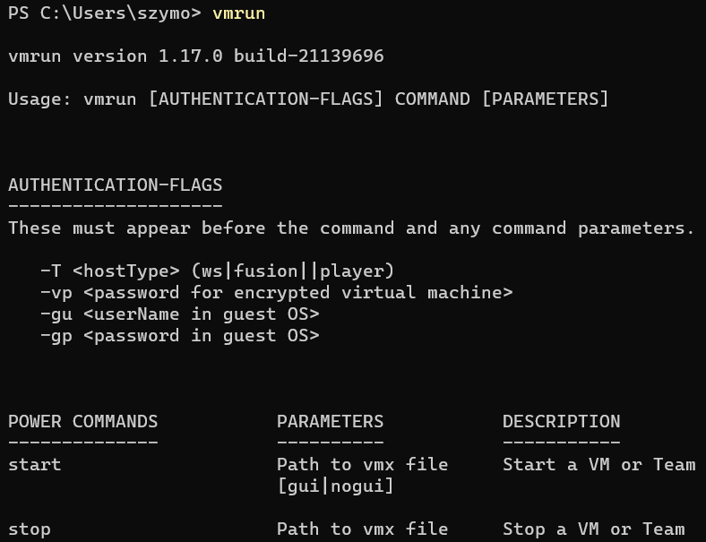
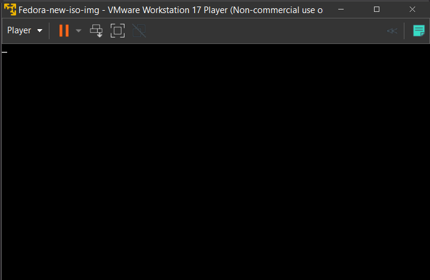

# Sprawozdanie LAB_09:
- Pliki odpowiedzi dla wdrożeń nienadzorowanych

Szymon Rogowski (405244), AGH UST, WIMIIP Faculty

## Zakres podstawowy
1. Instalacja Fedora OS - wstęp:
Celem było zainstalowanie "light-weight" Fedora systemu operacyjnego:  
```
https://fedoraproject.org/pl/server/download/   
```
Kolejno wybranie opcji pobierania: Fedora Server 38 Netboot iso - analogicznie jak w poprzednim laboratorium.
Finalnie należało pobranie pliku kickstart, czyli pliku konfiguracyjnego występującego w dystrybucji Fedora 
(jak i innych systemach operacyjnych Unix/Linux).
Plik kickstart zawiera instrukcje dla instalatora systemu operacyjnego, w tym informacje o partycjonowaniu dysku, 
konfiguracji sieci, wyborze pakietów do zainstalowania, ustawieniach lokalizacyjnych, ustawieniach użytkowników (w tym
usernameach, hasłach) oraz wielu innych opcjach. 
Zamiast ręcznie wykonywać te kroki podczas instalacji, plik kickstart umożliwia ich zautomatyzowanie, co pozwala na 
łatwiejsze i bardziej powtarzalne instalacje systemu operacyjnego.
Pliki te po pobraniu kolejno można przetrzymywać w wielu postaciach, jednakże najpopularniejszym sposobem jest trzymanie
plików na serwerze FTP, HTTP lub NFS.

2. Pobranie pliku:  
Zatem w pierwszej Fedorze znajduję plik:  
  
Który znajduje się na ścieżce:
```
/root/anaconda-ks.cfg
```
Następnie plik zamieszczam w repozytorium:
```
https://github.com/InzynieriaOprogramowaniaAGH/MDO2023_INO/blob/SR405244/INO/GCL2/SR405244/Lab09/anaconda-ks.cfg
```

3. Edycja pliku konfiguracyjnego 
Następnie należało edytować plik konfiguracyjny zgodnie z instrukcją, w moim przypadku z uwagi na to, że finalny artefakt
z poprzedniego labu zamknąłem w postaci kontenera, moim celem było dodanie automatycznego pobrania w czasie instalacji 
Dockera wraz z wszystkimi dependencjami do sekcji **%packages**. Sekcja ta właśnie określa jakie pakiety mają być 
zainstalowane podczas automatycznej instalacji systemu operacyjnego. Są one pobierane z oficjalnego repozytorium Fedory,
prowadzonego przez Red Hat.  
Również musiałem dodać potrzebne repozytoria:
```
url --mirrorlist=http://mirrors.fedoraproject.org/mirrorlist?repo=fedora-38&arch=x86_64
repo --name=update --mirrorlist=http://mirrors.fedoraproject.org/mirrorlist?repo=updates-released-f38&arch=x86_64
```
Linia "url" ustawia lustra dla samej dystrybucji Fedora. Opcja "--mirrorlist" oznacza, że "mirrory" będą pobierane z "listy luster"
dostarczonej przez serwer projektu Fedora prowadzonego przez Red Hat. Natomiast adres URL wskazuje na plik listy luster 
dla repozytorium "fedora-38" (wersji 38) dla architektury systemu operacyjengo: x86_64.
Wspomniane "lustra" to bodajże kopie repozytoriów oprogramowania, które są udostępnione publicznie i pozwalają na 
szybszy i bardziej niezawodny dostęp do pakietów. Repozytoria te zawierają różnego rodzaju oprogramowanie, 
w tym biblioteki, narzędzia, sterowniki i aplikacje. Same w sobie pozwalają na pobieranie pakietów z serwerów 
podrzędnych, co skraca czas pobierania i zmniejsza obciążenie serwerów głównych. Inne dystrybucje również posiadają analogiczne
odpowiedniki.


Finalnie w sekcji **%post**, w której umieszczamy skrypty i komendy, które mają być wykonane po zainstalowaniu systemu,
najpierw ustawiamy wysyłanie logów z procesu "post-installation" do pliku - będzie on obecny na nowo powstałym hoście:
```
/var/log/post.log
```
Następnie tworzymy plik BASH /opt/deploy.sh w katalogu /etc/systemd/system, który uruchomi usługę dockera i pobierze obraz 
kontenera srpl/go-deploy-img:91, a następnie uruchomi kontener na porcie 3001. Po utworzeniu pliku deploy.sh ustawiamy
na nim prawa wykonywania za pomocą chmod +x.    
Następnie tworzymy plik usługi systemd (INSTALATORA!) o nazwie deploy.service, który uruchomi skrypt deploy.sh.   
W sekcji [Install] wskazujemy, że usługa powinna być uruchamiana po uruchomieniu systemu w trybie wielu-użytkowników.  
Tworzenie skryptu jak i usługi odbywa się w klauzuli "EOF": "cat << EOF" to tzw. "Here Document".  
Pozwala na wprowadzenie wielu linii tekstu wraz ze znakami specjalnymi do pliku lub przekazanie ich jako dane wejściowe do innego programu.  


Całość pliku konfiguracyjnego:
```
# Generated by Anaconda 38.23.4
# Generated by pykickstart v3.47
#version=F38
# Use graphical install
graphical
# Keyboard layouts
keyboard --vckeymap=pl --xlayouts='pl'
# System language
lang pl_PL.UTF-8

url --mirrorlist=http://mirrors.fedoraproject.org/mirrorlist?repo=fedora-38&arch=x86_64
repo --name=updates --mirrorlist=http://mirrors.fedoraproject.org/mirrorlist?repo=updates-released-f38&arch=x86_64

%packages
@^server-product-environment
nano
openssh-server
# Docker
# https://linuxconfig.org/how-to-install-and-configure-docker-ce-moby-engine-on-fedora-32
moby-engine
containerd
runc
container-selinux
%end

# Run the Setup Agent on first boot
firstboot --enable
# Generated using Blivet version 3.7.1
ignoredisk --only-use=nvme0n1
autopart
# Partition clearing information
clearpart --none --initlabel
# System timezone
timezone Europe/Warsaw --utc

# Root password
rootpw --iscrypted --allow-ssh $y$j9T$CFyABidjdQkZd3NXOe.WlwV/$dLL8YO7C.MZpSYdWCT3AMRCYM.VpQbTBJHPZ/u8gUk0
user --groups=wheel --name=szymonr --password=$y$j9T$ha22Qxi.FUiJLQ9RVyXAvFbW$373tSSaoMxIzLCGqBLn2jHMfqmURzEvdeZkDeB.S0.C --iscrypted --gecos="Szymon Rogowski"

%post --log=/var/log/post.log
echo "################################"
echo "# Running Post Configuration   #"
echo "################################"

cat <<EOF > /opt/deploy.sh
#!/bin/bash
systemctl start docker
docker pull srpl/go-deploy-img:91
docker run -d -p 3001:3001 srpl/go-deploy-img:91
EOF

chmod +x /opt/deploy.sh

cat <<EOF > /etc/systemd/system/deploy.service
[Unit]
Description=Deploy service
[Service]
ExecStart=/opt/deploy.sh
Type=simple
[Install]
WantedBy=multi-user.target
EOF

# Zakomentowane komendy nie zadziałają ponieważ system jeszcze nie wystartował, zaś systemd to systemd instalatora, NIE systemu operacyjnego - tylko na systemd instalator można uruchomić usługę.
# systemctl daemon-reload
systemctl enable deploy.service
# systemctl start deploy.service

%end
```

4. Proces uruchomiania systemu na podstawie "kickstart file":  
W czasie pierwszego bootowania systemu należy opcje "e", aby bootwać system z własnymi komendami systemowymi.  
    
Proces instalacji oraz post-instalacyjny zostały wykonane, jak i automatyczne ustawienie domyślnych opcji systemu na podstawie
pliku konfiguracyjnego:  
  
  

Sprawdzenie poprawności całego procesu:   
Obraz pobrany, kontener uruchomiony, widoczny adres IP hosta oraz adres IP kontenera:    
  
Wykonanie przykładowych zapytań zakończone sukcesem - dla /hello oraz /add, dla wartości [5,1]:    
    


## Zakres rozszerzony
- Należało zmodyfikować plik ISO (czyli plik zawierający obraz całego systemu operacyjnego, wraz z plikami instalacyjnymi i strukturą
katalogów) systemu operacyjnego Fedora Server, w wersji 38. Dokładnym celem była zmiana pliku **grub.cfg** znajdującego się 
w katalogu **/EFI/BOOT/** paczki ISO. 
Aby tego dokonać należało by podąrzać za instrukcją firmy Red Ha:
https://access.redhat.com/solutions/60959
Jednkże wymagało to opłacenia subskrypcji płatnego konta. Zatem można było wykorzystać poprawną odpowiedź znalezioną 
na portalu Stack Exchange - każdy z kroków jest tu opisany, więc nie będę tego robił:  
https://serverfault.com/questions/517908/how-to-create-a-custom-iso-image-in-centos
Można było również wykorzystać takie narzędzie managera plików jak Midnight Commander (https://midnight-commander.org/) przykładowo, zamiast pracy z samą konsolą:

```
How to create a custom ISO image in CentOS:  
```
      
      

Jednakże należało dostosować tą instrukcje do potrzeb innej dystrybucji Linuxa, mianowicie:  
1. W punkcie numer 7 nie kopiowałem nowej pliku rozruchowego - kickstart - a dokonałem zmian w istniejącym **grub.cfg**,
które polegały na usunięciu klauzuli "quiet" i zamianie na:
```
menuentry 'Install Fedora 38' --class fedora --class gnu-linux --class gnu --class os {
        linuxefi /images/pxeboot/vmlinuz inst.stage2=hd:LABEL=Fedora-S-dvd-x86_64-38 inst.ks=https://raw.githubusercontent.com/InzynieriaOprogramowaniaAGH/MDO2023_INO/SR405244/INO/GCL2/SR405244/Lab09/anaconda-ks.cfg?token=GHSAT0AAAAAAB22QUCPOJPKO7WA6FSI7QVCZDBBCOQ
        initrdefi /images/pxeboot/initrd.img
}
```
2. Na wszelki wypadek w punkcie numer 2 zmieniłem i wykorzystałem komendę:
```
sed -i 's/inst.stage2=hd:LABEL=Fedora-S-dvd-x86_64-38 inst.ks=https:\/\/raw.githubusercontent.com\/InzynieriaOprogramowaniaAGH\/MDO2023_INO\/SR405244\/INO\/GCL2\/SR405244\/Lab09\/anaconda-ks.cfg/inst.stage2=hd:LABEL=Fedora-S-dvd-x86_64-38 inst.ks=cdrom:\/ks.cfg/' /tmp/bootisoks/EFI/BOOT/grub.cfg
```  
     
3. W punkcie numer 10 tworzenie nowego obrazu OS w postaci ISO przy użyciu komendy, pakiety **mkisofs** w moim wypadku miało postać:
```
sudo mkisofs -o ~/new-iso-img.iso -b EFI/BOOT/BOOTX64.EFI -no-emul-boot -boot-load-size 4 -boot-info-table -V "Fedora 38 x86_64" -R -J -v -T /tmp/bootisoks
```  
     
     
    

Bardzo ważnym elementem jest stample w postaci MD5 checksum, czyli wartości liczbowej wyliczonej z pliku za 
pomocą algorytmu MD5, który jest używany w celu weryfikacji integralności pliku. Służy on do sprawdzenia, czy plik został 
pobrany lub skopiowany poprawnie, czy nie został zmieniony w trakcie przesyłania lub kopiowania. W przypadku weryfikacji
poprawności obrazu ISO przed instalacją systemu, sprawdzenie MD5 checksum pozwala upewnić się, że obraz jest kompletny 
i nie ma żadnych uszkodzeń, które mogłyby prowadzić do nieprawidłowej instalacji systemu. 
**W przypadku nie podbicia nowego ISO poprzez MD5 checksum obraz nie będzie działał poprawnie, zgłosi "brak autentyfikacji
pochodzenia obrazu."** --- brak certyfikacji, ponieważ podczas uruchamiania systemu z obrazu ISO, bootloader (np. właśnie GRUB) 
sprawdza, czy plik obrazu ISO ma zgodną wartość MD5 checksum z wartością zapisaną w pliku MD5SUMS. 
Jeśli wartości się nie zgadzają, oznacza to, że plik został uszkodzony lub zmodyfikowany, co może prowadzić do 
nieprawidłowego uruchomienia systemu.  
Wychodzi na to że w ten sposób mamy działające ISO:    
    

- Można było również zwiększyć poziom automatyzacji tworzenia systemu operacyjnego wykorzystująć cmdlety dla Hyper-V (https://learn.microsoft.com/en-us/virtualization/hyper-v-on-windows/quick-start/try-hyper-v-powershell), 
czy też VBoxManage dla VirtualBoxa (https://www.virtualbox.org/manual/ch08.html).  
W moim wypadku było to VMWare w wersji relatywnie bardzo okrojonej w funkcjonalności w stosunku do komercyjnej wersji 
"Enterprise", zatem musiałbym wykorzystać usługę o nazwie: **vmrun** -  po instalacji VMWorkstation należało, by dodać zmiennej
środowiskowej "Path", ścieżkę do katalogu w którym znajduje się **vmrun.exe**. Kolejno sprawdzenie działania komendy:  
      

Generalnie __nie udało mi się dokończyć tej części__ związanej z automatyzacją, z uwagi na brak czasu. Bowiem wygenerowany plim o którym wspomnę potem (**.vmxf**) nie do końca wygenerował się poprawnie, nie zawiera kilku domyślnych sekcji. W tym momencie należało
by stworzyć nową maszynę w GUI VMWare Workstation, wybierając opcje "I will install OS later.". Kolejno należało by znaleźć
wygenerowany plik w katalogu "WMWare" w katalogu "Program Files" na Windows 11 z rozszerzeniem ".vmxf" - plik ma taką samą 
nazwę jak nazwa stworzonej maszyny wirtualnej bez podanego ISO. Finalnie należało by pobrać zmodyfikowany obraz ISO z Linuxa, 
na którym ten obraz był modyfikowany i podpięty do pliku - moim wypadku **fedora-vmxf-iso.vmxf**.  
Ten plik należało by edytować dodając jakieś odnośniki do lokalizacji pliku ISO, sugerując się oficjalną dokumentacją:
https://docs.vmware.com/en/VMware-vSphere/7.0/com.vmware.vsphere.vm_admin.doc/GUID-CEFF6D89-8C19-4143-8C26-4B6D6734D2CB.html  

Finalnie pasowało by spiąć komendy **vmrun** - https://docs.vmware.com/en/VMware-Fusion/13/com.vmware.fusion.using.doc/GUID-24F54E24-EFB0-4E94-8A07-2AD791F0E497.html
w jakiś skrypt np **Batch** i uruchomić co powinno prowadzić do oczekiwanych rezultatów, ale tak jak mówie nie zdążyłem sprawdzić tego
podejścia.  

- Sprawdzenie działania podjętych kroków w ramach instalacji nienadzorowanej:
Zatem pomijając ostatni podpunkt, pobieram "ręcznie" obraz wygenerowany na Fedorze i podpinam go jako ISO w instalacji VMWare:    
  

Niestety, ale coś jest nie tak z wygenerowanym plikiem ISO, gdzieś na całej tej drodze musi być błąd, ponieważ maszyna jest zawieszona
w stanie "blinking-cursor" od kilku minut:    
      


### Komemtarz:
Pasowało by przede wszystkim prześledzić co mogło pójść nie tak na drodze zarówno podpinania pliku ISO, chociaż tutaj raczej
nie miało co pójść źle, kwestia dosłownie "kliknięcia w plik" w przypadku podstawowym, no chyba, że mowa o automatyzacji przy pomocy
konsoli PowerShell i toola **vmrun**.  
<br>
<br>
Natomiast myślę, że pasowało by raczej pochylić się nad procesem tworzenia tego ISO, które
na pierwszy rzut oka wydaje się, iż zostało wygenerowane poprawnie, a przynajmniej powinno.
Plus rzecz jasna ogarnąć dokładnie procedure automatyzacji przy pomocy vmrun, lub zmienić Hypervisor'a na VB czy Hyper-V,
co może ułatwiło by sprawę.
