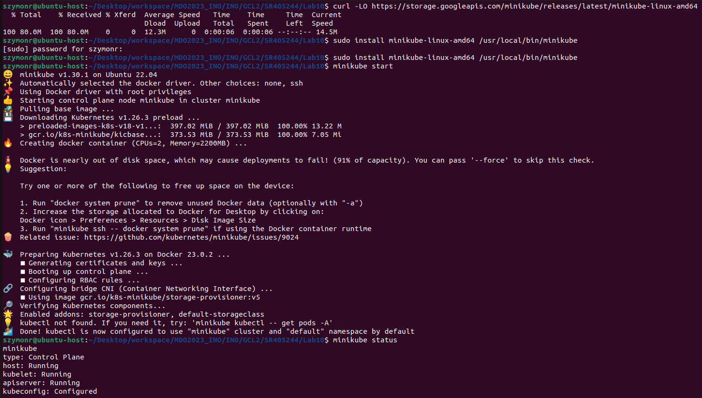

# Sprawozdanie LAB_10:
- Wdrażanie na zarządzalne kontenery: Kubernetes (1)

Szymon Rogowski (405244), AGH UST, WIMIIP Faculty

## Instalacja klastra Kubernetes
1. Implementacja stosu **k8s:minikube** wedle oficjalnej dokumentacji (https://minikube.sigs.k8s.io/docs/start/) wraz z 
sprawdzeniem statusu klastra lokalnego:  
  
2. Instalacja **kubectl** wedle oficjalnej dokumentacji (https://kubernetes.io/docs/tasks/tools/install-kubectl-linux/#install-kubectl-binary-with-curl-on-linux):  
  
  
  
   
Kluster minikube postawiony, kubectl można również pobrać używając:  
   
3. Wylistowanie działajacych kontenerów/workerów działających na lokalnym klastrze - wszystko ok:
  
Natomiast jeśli chodzi o zasoby to raczej wszystko jest w porządku, minikube nie wymaga za wiele, bodajże - wedle 
dokumentacji:
- Procesor z obsługą wirtualizacji, 2 rdzeniowy - u mnie 6 rdzeni, można sprawdzić w "menadżerze zadań" Windows11
- Min 2GB ram - przydzielone 8GB ramu dla wirtualki z Kubernetesem, można sprawdzić w opcjach maszyny wirtualnej w interfejsie hypervisora
- Min 20GB hard drive memory - wolne jeszcze 30GB, można sprawdzić w opcjach maszyny wirtualnej w interfejsie hypervisora
- Karta sieciowa z obsługą NAT - spełnione, można sprawdzić w "menadżerze urządzeń" Windows11

4. Uruchomienie dashboarda w przeglądarce domyślnej systemu, łączność odbywa się na localhoście na porcie 40227:
```
http://127.0.0.1:40227/api/v1/namespaces/kubernetes-dashboard/services/http:kubernetes-dashboard:/proxy/
```
    
    
Natomiast zapoznanie z tematyką Kubernetes wedle źródeł:  
- https://kubernetes.io/docs/concepts/overview/
- https://kubernetes.io/docs/tutorials/kubernetes-basics/
- https://kubernetes.io/docs/tasks/administer-cluster/  
itd.

## Analiza posiadanego kontenera
Celem tego podpunktu było przygotowanie obrazu Deploy z aplikacją, zatem najlepiej, aby ta nadawała się do pracy w kontenerze.
Celem maximum dla tego podpunktu był wybór aplikacji, której obraz został wygenerowany na wskutek pracy pipeline. Postanowiłem
zatem wykorzystać jeden z wcześniejszych laboratoriów i wykorzystać aplikacje napisaną przeze mnie w Golangu przedstawiającą
prosty kalkulator, który jest oparty na REST API: https://github.com/InzynieriaOprogramowaniaAGH/MDO2023_INO/blob/SR405244/INO/GCL2/SR405244/Lab05-07/Sprawozdanie05-07/Sprawozdanie05-07.md  
Obraz Deploy został w ramach kroku Publish, czyli finalnego artefaktu, umieszczony na DockerHubie, dlatego też pobieram 
go z rejestru DockerHuba i uruchamiam w tle na porcie 3001 - wszystko działa poprawnie oraz zgodnie z założeniami:   
 

## Uruchamianie oprogramowania
1. Najpierw uruchomiłem kontener w minikubie przy pomocy kubectl, kontener ten został automatycznie ubrany w pod:
  
2. Kolejno przedstawiam działanie poprzez **Dashboard** oraz **kubectl**:
  
  
  
 
3. Uzyskuje dostęp do eksponowanej funkcjonalności w podzie poprzez wyprowadzenie portu - gdzie pierwsza cyfra to numer portu
na hoście, natomiast druga to numer portu w podzie, na którym działa wspomniana funkcjonalność: 
  
4. Następnie wykonuje przykładowe rządania API, dla portu 3002 jest to wykorzystanie poda Kubernetesa, natomiast na porcie 
3001 mam odpalony kontener bazowany na obrazie Deploy, który jest również ujęty w podzie - dla porównania, jak widać wyniki działań
dla różnych portów są identyczne, zatem działa wszystko poprawnie:
 
## Przekucie wdrożenia manualnego w plik wdrożenia (wprowadzenie)
1. Zapisałem wdrożenie jako **deployment.yaml**, przy pomocy **kubectl create deployment**:
```
apiVersion: apps/v1
kind: Deployment
metadata:
  creationTimestamp: null
  labels:
    app: go-deploy-pod-1
  name: go-deploy-pod-1
spec:
  replicas: 3
  selector:
    matchLabels:
      app: go-deploy-pod-1
  strategy: {}
  template:
    metadata:
      creationTimestamp: null
      labels:
        app: go-deploy-pod-1
    spec:
      containers:
      - image: srpl/go-deploy-img:91
        name: go-deploy-img
        resources: {}
status: {}
```
2. Utworzyłem wdrożenie oraz wdrożyłem nową definicję wdrożenia, dodając zmiany w liczbie **replicas** (czyli liczbie instancji danego poda) przy pomocy **kubectl apply**
w postaci pliku .yaml - które umożliwia zarządzanie replikami aplikacji i aktualizowanie aplikacji w sposób bezpieczny i nieprzerwalny.
Deployment, w tym wypadku "yamlowy", definiuje pożądany stan aplikacji i pozwala na automatyczne wdrożenie i skalowanie:  
 
Oraz sprawdziłem rezultaty przy pomocy **CLI kubectl** (przy pomocy **kubectl get pods**) oraz **Dashboarda minikube** (przy pomocy
przeglądarki przy pomocy **minikube dashboard**):  
  

Wszystko działa poprawnie i zgodnie z zamierzeniami, jak i instrukcją.

