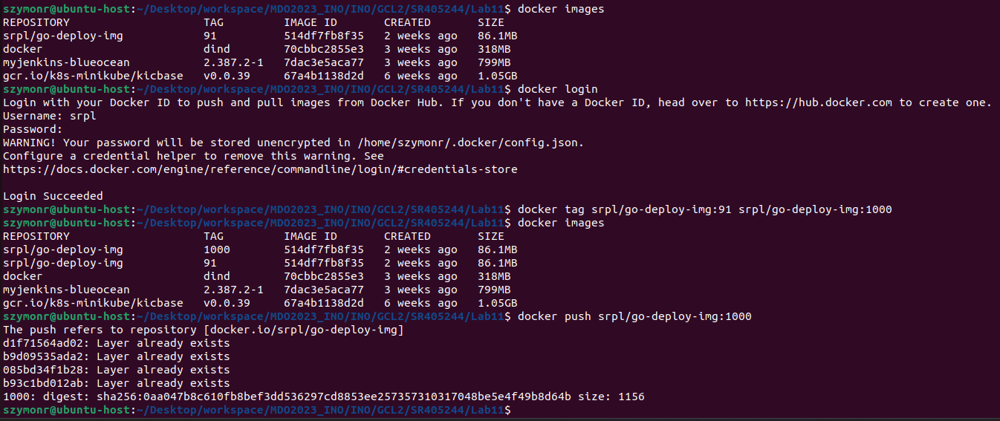
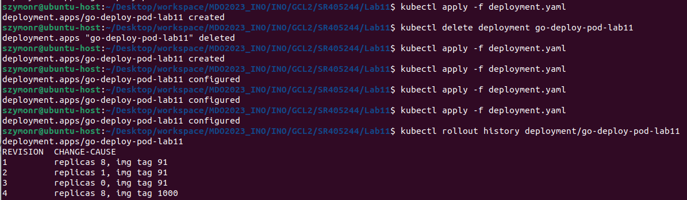

# Sprawozdanie LAB_11:
- Wdrażanie na zarządzalne kontenery: Kubernetes (2)

Szymon Rogowski (405244), AGH UST, WIMIIP Faculty

## Konwersja wdrożenia ręcznego na wdrożenie deklaratywne YAML
Dodanie do obrazu 4 replik, poprzez zmianę definicji pliku wdrożenia. Kolejno aplikuje wdrożenie - **kubectl apply** 
oraz sprawdzam jego stan - **kubectl rollout status**:  
  
    

Sama zawartość pliku **deployment.yaml**:
```
apiVersion: apps/v1
kind: Deployment
metadata:
  name: go-deploy-pod-lab11
  annotations:
    kubernetes.io/change-cause: "replicas 8, img tag 1000"
spec:
  replicas: 8
  selector:
    matchLabels:
      app: go-deploy-k8s
  template:
    metadata:
      labels:
        app: go-deploy-k8s
        version: v4
    spec:
      containers:
      - image: srpl/go-deploy-img:1000
        name: go-deploy-img
        resources: {}
```

## Przygotowanie nowego obrazu
Z uwagi na to, iż nie mam problemów z krokiem "Deploy", postanowiłem ręcznie przygotować nową wersję obrazu z poziomu 
CLI Linuxa, zatem dwie ostatnie wersje obrazu to 91 i 1000 (dla wyróżnienia). Aby przygotować obraz z błędem, musiałbym 
od nowa konfigurować Jenkinsa, czego nie mogę wykonać obecnie z uwagi na znikomą ilość czasu. Natomiast aplikacja z błędem, 
z tego co rozumiem z instrukcji ma jedynie za zadanie lepsze zobrazowanie możliwości Kubernetesa w przypadku zmiany wersji,
przywracania poprzednich, zatem i tak będę wstanie wykonać kolejne kroki - próbowałem ewentualnie wykorzystać **docker commit**,
na zasadzie:
```
docker commit <CONTAINER_ID> <CONTAINER_NAME>:<1000>
```
Jednakże problem był z edycją pliku binarnego, ponieważ nie za bardzo byłem wstanie go zapisać, ponieważ jest on w użytku kontenera
za każdym razem gry go uruchomię, zabicie procesu wykonującego tenże plik binarny natomiast kończy prace kontenera:  
  
   
Wpierw loguje (**docker login**) się do DockerHuba, taguje (**docker tag**) obraz z innym numerem wersji i wysyłam na 
zdalny rejestr (**docker push**):  
   


## Zmiany w deploymencie
Przeprowadzenie kilku deploymentów dla zmieniających się parametrów konfiguracyjnych wdrożenia. Widoczne jest kilka rewizji
danego wdrożenia, czyli pewnego rodzaju instancji wdrożenia o określonych i różnych od siebie parametrach (niekoniecznie
wszystkich) - wykorzystanie komendy **kubectl rollout history** dla określonego typu zasobu (deployment) oraz nazwy konkretnego
deployment (nazwa mojego wdrożenia w pliku .yaml):   
  
Kolejno wykorzystanie komendy **kubectl rollout undo** do przełączanie pomiędzy rewizjami (wersjami) wdrożenia. 
Wykorzystanie flagi **--to-revision** do powrócenia do konkretnej rewizji, ponieważ domyślnie jak widać poniżej brak tej flagi
powoduje przełączanie pomiędzy dwoma rewizjami, ostatnia staje się przedostatnią, przedostatnią ostatnią i cykl się zamyka:
  

## Kontrola wdrożenia
- Napisałem skrypt weryfikujący czy wdrożenie udało się w ciągu 60 sekund, został on napisany w Bash-Shell.  
  
Sama zawartość pliku **time-check.sh**:  
```
#!/bin/bash

start_time=$(date +%s)

kubectl apply -f deployment.yaml

deploy_ready=false

while [ "$deploy_ready" = false ]; do
  deployment_status=$(kubectl get deployment go-deploy-pod-lab11 -o jsonpath='{.status.conditions[?(@.type=="Available")].status}')
  
  if [ "$deployment_status" = "True" ]; then
    deploy_ready=true
  else
    current_time=$(date +%s)
    elapsed_time=$((current_time - start_time))
  
    if [ "$elapsed_time" -gt 60 ]; then
      echo "Błąd: Czas wdrożenia przekroczył 60 sekund."
      exit 1
    fi
  
    sleep 1
  fi
done

end_time=$(date +%s)
duration=$((end_time - start_time))

echo "Wdrożenie zakończone pomyślnie."
echo "Czas trwania wdrożenia: $duration sekund."
exit 0
```
- Natomiast jeśli chodzi o pipeline, wydaje mi się ży wystarczyło by, aby zaimplementować to w postaci
odpalenia skryptu znajdującego się na zaciągniętym repo **https://github.com/InzynieriaOprogramowaniaAGH/MDO2023_INO.git**
wykorzystywanym w Labie 5, 6, 7. Należało by jedynie w trakcie stage "Deploy" odpalić skrypt napisany w Bashu:
```
        stage('Deploy') {
            steps {
                sh 'echo "Start Deploy"'
                script {
                    dir('MDO2023_INO') {
                        sh "docker build -t go_deploy_img:latest -f ${DOCKER_BUILD_DIR}/go_deploy ${DOCKER_BUILD_DIR}"
                        sh "docker run -d -p 3001:3001 --name go_deploy_cont go_deploy_img:latest"
                        sleep(5)
                        sh "docker logs go_deploy_cont"
                        sh "docker ps -a"
                        sh "ls -a"
                        
                        
                        sh "bash time-check.sh"
                        
                        
                        sh "docker container stop go_deploy_cont"
                        sh "docker container rm -f go_deploy_cont"
                        sh "kubectl delete deployment go-deploy-pod-lab11"
                    }
                }
                sh 'echo "Deploy finished"'
            }
        }
```

Oczywiście wcześniej należy uruchomić Kubernetesa na "Jenkins BlueOcean", na szczęście obraz ten defaultowo zawiera
takie narzędzia jak Kubernetes, Docker czy Git co umożliwia nam pominięcie kroków pobierania, instalacji i konfiguracji.
Zatem gdzieś po drodze należało by dodać **sh "minikube start"**, a jeszcze wcześniej pasowało by:
1. Zainstalowanie kubectl na Jenkinsie.
2. Zlokalizowanie pliku .kube w katalogu domowym zawierającym informacje o klastrze Kubernetes.
3. Konfiguracja Jenkinsa, aby mógł korzystać właśnie z kubeconfig - "Manage Jenkins" > "Configure System", itd.
4. Restart Jenkinsa i powinno wszystko działać.
Kolejno, gdy dojdzie do stage "Deploy", skrypt zawierający odwołania do Kubernetesa powinien działać poprawnie.  
Natomiast nie przetestowałem tego podejścia, jest to jedynie luźny opis oparty o dokumentacje i własną wiedzę.  

## Strategie wdrożenia
Przygotowanie różnych wersji wdrożeń stosujące 3 strategie wdrożeń:  
Useful links:  
- https://azure.microsoft.com/pl-pl/solutions/kubernetes-on-azure/deployment-strategy  
- https://kubernetes.io/docs/concepts/workloads/controllers/deployment/
- https://blog.container-solutions.com/kubernetes-deployment-strategies

1. Recreate - polega na **całkowitym zastąpieniu istniejących podów nowymi wersjami**. 
Proces ten polega na zatrzymaniu wszystkich podów obecnej wersji i utworzeniu nowych podów z najnowszą wersją aplikacji.  
W praktyce strategia ta polega na:  
- W pierwszej sytuacji mamy obraz aplikacji w wersji 90: 
  
- Następnie zmieniamy tag obrazu na 91, co skutkuje aktualizacją wszystkich podów:
  
  

**KOMENTARZ**: sekcja zawierająca oznaczenia iż 10 replik jest "unavailable" wynika tylko i wyłącznie z tego, iż start
10 aplikacji trwa określoną liczbę czasu, na co ja nie oczekuję:  
```
Replicas:               10 desired | 10 updated | 10 total | 0 available | 10 unavailable
```

Typ wdrożenia definiujemy dodając do deployment.yaml:
```
spec:
  replicas: 4
  strategy:
    type: Recreate
```

2. Rolling Update - polega **na stopniowym aktualizowaniu podów aplikacji w klastrze**. 
Proces ten polega na stopniowym zatrzymywaniu starych podów i uruchamianiu nowych podów z najnowszą wersją. 
Można kontrolować tempo aktualizacji, ustalając parametry, takie jak liczba podów, które można aktualizować jednocześnie.  
- W wersji 90 obrazu, widoczny poprostu start 10 podów
  
- Natomiast po zmianie na wersję 91:
  

Istotny staje się opis:
```
Events:
  Type    Reason             Age                 From                   Message
  ----    ------             ----                ----                   -------
  Normal  ScalingReplicaSet  2m54s               deployment-controller  Scaled up replica set go-deploy-pod-lab11-865956595f to 10
  Normal  ScalingReplicaSet  112s                deployment-controller  Scaled up replica set go-deploy-pod-lab11-647c77ccfb to 2
  Normal  ScalingReplicaSet  112s                deployment-controller  Scaled down replica set go-deploy-pod-lab11-865956595f to 9 from 10
  Normal  ScalingReplicaSet  112s                deployment-controller  Scaled up replica set go-deploy-pod-lab11-647c77ccfb to 3 from 2
  Normal  ScalingReplicaSet  109s                deployment-controller  Scaled down replica set go-deploy-pod-lab11-865956595f to 8 from 9
  Normal  ScalingReplicaSet  109s                deployment-controller  Scaled up replica set go-deploy-pod-lab11-647c77ccfb to 4 from 3
  Normal  ScalingReplicaSet  109s                deployment-controller  Scaled down replica set go-deploy-pod-lab11-865956595f to 6 from 8
  Normal  ScalingReplicaSet  109s                deployment-controller  Scaled up replica set go-deploy-pod-lab11-647c77ccfb to 6 from 4
  Normal  ScalingReplicaSet  104s                deployment-controller  Scaled down replica set go-deploy-pod-lab11-865956595f to 5 from 6
  Normal  ScalingReplicaSet  95s (x9 over 104s)  deployment-controller  (combined from similar events): Scaled down replica set go-deploy-pod-lab11-865956595f to 0 from 1

```
Gdzie otrzymujemy następujące informacje:
- Zdarzenie: "Scaled up replica set go-deploy-pod-lab11-865956595f to 10" ---> początkowo istniejące repliki w starszej wersji zostały zwiększone do 10.
- Zdarzenie: "Scaled up replica set go-deploy-pod-lab11-647c77ccfb to 2" ---> nowe repliki w nowszej wersji zostały utworzone w ilości 2.
- Zdarzenie: "Scaled down replica set go-deploy-pod-lab11-865956595f to 9 from 10" ---> liczba replik w starszej wersji została zmniejszona do 9.
- Zdarzenie: "Scaled up replica set go-deploy-pod-lab11-647c77ccfb to 3 from 2" ---> liczba replik w nowszej wersji została zwiększona do 3.
Proces kontynuuje się, z kolejnymi zdarzeniami "Scaled down" i "Scaled up", aż do zakończenia aktualizacji.
Finalnie wdrożenia strategii "Rolling Update" z konfiguracją **maxSurge: 2 i maxUnavailable: 1** doszło do stopniowego
zwiększania liczby replik w nowszej wersji i równoczesnego zmniejszania liczby replik w starszej wersji, aż do osiągnięcia
końcowego stanu z 10 replikami w nowszej wersji obrazu (czyli też wdrożenia) i brakiem replik w starszej wersji obrazu (czyli też wdrożenia).


Typ wdrożenia definiujemy dodając do deployment.yaml:
```
spec:
  replicas: 10
  strategy:
    type: RollingUpdate
    rollingUpdate:
      maxSurge: 2
      maxUnavailable: 1
```

3. Canary Deployment - polega na **wprowadzeniu nowej wersji aplikacji do klastra, ale tylko dla niewielkiego podzbioru 
użytkowników lub ruchu**. W sytuacji, gdy na przykład, aplikacja jest w wersji 1.0, strategia ta pozwoliłaby na 
wdrożenie wersji 2.0 tylko dla 1% użytkowników, podczas gdy pozostałe 99% korzystałoby nadal z wersji 1.0. 
Pozwala to na testowanie nowej wersji na "żywym" środowisku, zbieranie feedbacku, ciągła naprawa napływających błędów, przed pełnym 
wdrożeniem dla wszystkich użytkowników.
Zrealizowane na podstawie:
- https://earthly.dev/blog/canary-deployment-in-k8s/

Praktyczne zastosowanie tego podejścia można zaimplementować na podstawie tzw, **mechanizmu tzw. "traffic splitting"**. 
Można to osiągnąć przy użyciu narzędzi takich jak **Deployment**, **Service** i **Ingress**.  
**Deployment**, jak już wiadomo to sposób konfiguracji i zarządzania aplikacjami lub mikroserwisami w klastrze Kubernetes 
(oraz zasobami). **Serwis** (service) w K8s to abstrakcja, która definiuje stały punkt dostępu do aplikacji. Serwis umożliwia 
komunikację z aplikacją, niezależnie od tego, na którym węźle klastra znajduje się aplikacja, replika, pod. Dzięki serwisowi, aplikacje
mogą być dostępne wewnętrznie w klastrze (w obrębie serwisu) lub z zewnątrz klastra. Dzięki serwisowi, niezależnie 
od tego, na którym węźle klastra znajduje się replika aplikacji, można skierować żądania do serwisu, a system K8s automatycznie przekieruje je do odpowiedniej repliki - stabilny adres IP. 
Zapewnia to spójny dostęp do aplikacji i umożliwia łatwiejsze zarządzanie komunikacją w klastrze.  
Natomiast **Ingress** w K8s to mechanizm
zarządzania ruchem sieciowym jedynie na poziomie klastra. Umożliwia zarządzanie routingiem ruchu HTTP(S) do różnych serwisów 
w klastrze na podstawie reguł zdefiniowanych w zasobie Ingress (pliku yaml) - określa zasady routingu na klastrze pomiędzy
serwisami.  

**Podsumowując, deployment odpowiada za wdrażanie aplikacji, serwis zapewnia stały punkt dostępu do aplikacji, 
a Ingress zarządza ruchem sieciowym na poziomie klastra, kontrolując dostęp do serwisów z zewnątrz.**  

**Opis stosowania wdrożenia:**   
Aby wdrożyć w życie to podejście należy wpierw stworzyć 3 pliki: deployment.yaml, service.yaml oraz ingress.yaml, kolejno
stworzyć klony tych plików z mniejszą liczbą replik, z suffixem "-canary". 
Pierwsza trójka plików definiuj podejście "rolling update" - jako defaultową strategię K8S. Kolejna trójka zaś definiuje
właśnie "canary deployment". Pliki deployment różnią się tym, że w **deployment.yaml** mamy zaciągnięcie obrazu aplikacji
w wersji 90, o takim tagu - **zakładamy, że wersja 90 jest stabilna**, natomiast w **deployment-canary.yaml** definiujemy
zaciągnięcie obrazu w wersji 91, czyli niestabilnej, **kanarkowej**. Serwisy różnią się właściwie jedynie nazwami. 
W Kubernetesie nie ma jako takiego keyworda na określenie canary deployment w sekcji **strategy**.  
Różnice znajdują się w pliku **ingress-canary.yaml**, który definiuje:
```
  annotations:
   nginx.ingress.kubernetes.io/canary: "true"
   nginx.ingress.kubernetes.io/canary-weight: "20" 
```
Które określają:
- pierwsza ---> Ingress jest skonfigurowany jako canary deployment
- druga ---> wskazuje wagę kanarka (canary weight) w strategii canary deployment. Waga określa procentowy udział ruchu, 
który jest kierowany do kanarka (nowej wersji) w porównaniu do stabilnej wersji. W naszym przypadku, 20% ruchu zostanie 
skierowane do kanarka, podczas gdy pozostałe 80% ruchu będzie kierowane do stabilnej wersji.

Aby 80% ruchu leciało na stabilną wersję należy w ingress.yaml dodać:
```
  annotations:
    nginx.ingress.kubernetes.io/canary: "true"
    nginx.ingress.kubernetes.io/canary-weight: "80"
```

W ten o to sposób mamy podział ruchu w 20% do wersji niestabilnej i 80% do wersji stabilnej.  
Kolejno następuje proces monitorowania działania nowej wersji, zbieranie metryk wydajnościowych i informacji zwrotnych od użytkowników.
Jeśli bugi są usuwane i łatane z czasem udział procentowy wersji kanarkowej rośnie co finalnie prowadzi do określenia jej
jako wersji stabilnej.  


Nie miałem za bardzo czasu przetestować poprawnego wdrożenia tej strategii, jednakże wszystkie komponenty zostały wdrożone poprawnie:
  
  
Aby całkowicie przetestować działanie tejże strategii pasowało by:
- wykonać polecenia **kubectl get <typ_zasobu>** aby sprawdzić poprawne utworzenia zasobów
- wykonać polecenia **kubectl describe <nazwa_zasobu>** aby sprawdzić poprawną konfiguracje zasobów
- wykonać żądania HTTP/HTTPS do aplikacji, które są skierowane na adres IP lub nazwę hosta Ingressu. 
Następnie sprawdź, czy ruch jest kierowany zgodnie z oczekiwaniami między stabilną wersją a kanarkiem.
- wykonać polecenie **kubectl logs** aby monitorować aplikacje, serwisy i ingresy w poszukiwanie ewentualnych errorów
- Można również skorzystać z zewnętrznych narzędzi do monitorowania clustrów - np. Prometheus/Grafana, w przystępny sposób
można analizować metryki i wykresy, oraz ruch rozdzielany między stabilną wersją a kanarkiem, 
ale też wartości związane z obciążeniem, czasem odpowiedzi, ilością błędów itp.  

Etykiety:
Etykiety (labels) w Kubernetes są znakami opisowymi, które można przypisywać do różnych zasobów, takich jak pod, 
usługa czy wolumin. Są używane do identyfikowania i grupowania tych zasobów na podstawie określonych kryteriów.  
W kontekście wdrożeń, etykiety są używane do wyboru określonych podów do aktualizacji lub wdrożenia nowej wersji aplikacji.  
W moim wypadku labele wyglądają nastepująco - nie ma nomenklatury nazewnictwa ale poniższe etykiety są stworzone na podstawie
sugestii proponowanych przez twórców Kubernetesa:

```
  selector:
    matchLabels:
        app.kubernetes.io/name: go-deploy-k8s
        app.kubernetes.io/instance: go-deploy-k8s-final
        app.kubernetes.io/version: "1.1.1" # dowolna wersja wdrożenia
        app.kubernetes.io/managed-by: none
        app.kubernetes.io/component: REST-API-server
```


Porównanie strategii wdrożeń:  
Każda z nich ma swoje zalety i wady oraz odpowiednie use-case.
1. Recreate:
- Usunięcie wszystkich instancji starej wersji i wdrożenie nowej, nie ma sytuacji, że istnieją różne wersje jednocześnie.
- Zalety: Prosta i niezawodna strategia. Zapewnia przejrzystość, ponieważ wszystkie instancje są jednocześnie zaktualizowane.
- Wady: Przerwy w dostępności aplikacji podczas wdrożenia, ponieważ wszystkie instancje są tymczasowo niedostępne.

2. Rolling Updates:
- Nowa wersja jest stopniowo wdrażana, poprzez zastępowanie starej, w większości sytuacji mamy stan w którym istnieje więcej niż jedna wersja.
- Zalety: Minimalizuje przerwy w dostępności aplikacji, ponieważ tylko część instancji jest niedostępna w danym momencie.
- Wady: Może prowadzić do różnic wersji aplikacji między instancjami podczas przejścia. ???

3. Canary:
- Wdrażanie nowej wersji również stopniowe, poprawa błędów i wdrażanie na podstawie feedbacku z działającego produktu na małej grupie userów.
- Zalety: Umożliwia stopniowe wprowadzanie nowej wersji i zbieranie informacji zwrotnych przed pełnym wdrożeniem. Minimalizuje wpływ na użytkowników w przypadku problemów z nową wersją.
- Wady: Wymaga dodatkowej konfiguracji i monitorowania, aby skutecznie rozpoznać problemy i zebrać informacje zwrotne oraz finalnie poprawiać aplikacje.