# Sprawozdanie LAB_12:
- Wdrażanie na zarządzalne kontenery w chmurze (I) -> Cloud, Azure/AWS

Szymon Rogowski (405244), AGH UST, WIMIIP Faculty

1. Utworzenie **resource group**:  
- Najpierw utworzyłem "resource group", czyli tzw. "virtual container", logiczny kontener umożliwiający grupowanie i 
zarządzanie zasobami infrastruktury chmurowej. Grupa taka pozwala przede wszystkim na łatwe skalowanie 
horyzontalne i wertykalne, zarządzanie uprawnieniami zasobu oraz zarządzanie zasobami, w tym opłatami, "pricingiem".  
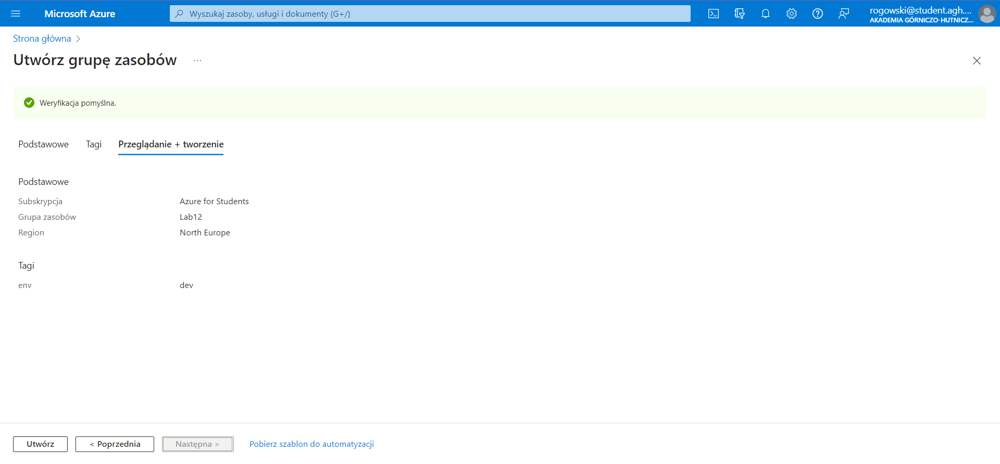  
Istnieje również dodany tag, czyli typ "klucz-wartość", metadane używane do oznaczania i organizowania zasobów w chmurze.
Dzięki tagom można organizować, kategoryzować i zarządzać zasobami w Azure w sposób bardziej elastyczny. 
Umożliwiają one lepsze zarządzanie kosztami, kontrolę dostępu, analizę danych i monitorowanie zasobów w chmurze, są integralną
częścią "resource group".

2. Wdrożenie kontenera z Docker Huba na Azure:
Wdrożenie odbywa się poprzez serwis Azure Container Service (ACS), w którym tworzę na dobrą sprawę kopię obrazu z Docker Huba
(dodając w toku konfiguracji **docker.io/srpl/go-deploy-img:91** - serwis, obraz, tag), poniżej przedstawiam dane podsumowujące dotyczące kontenera:  
Dodanie instancji zasobu w postaci kontenera w tym wypadku do "resource group":
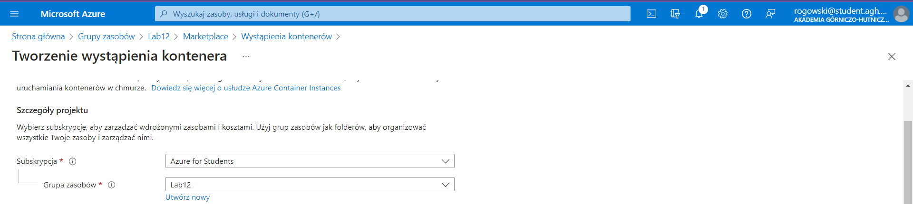  
Weryfikacja:  
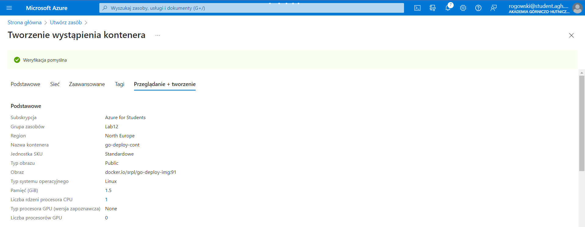  
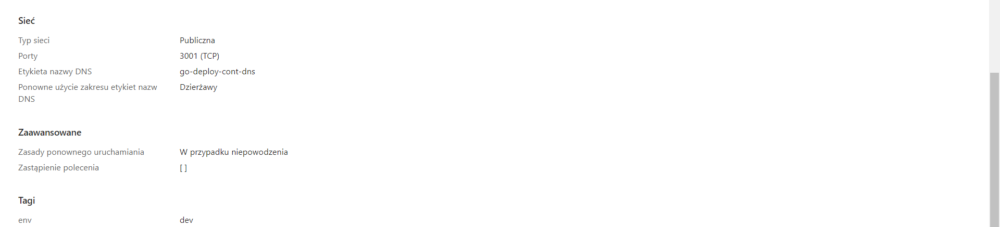  

Następnie procedura wdrożenia, powiodła się:  
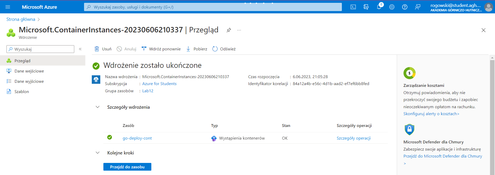  

Zasób w postaci kontenera znajduje się w "resource group":
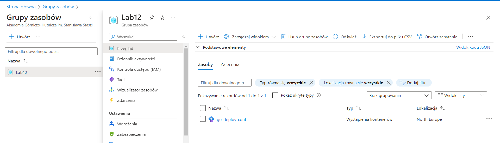 

Po przypisaniu zasobu, po kliknięciu na zasób/kontener wyświetlają się informacje na temat zasobu, takie jak ID, liczba replik, 
czy też zewnętrzne IP (niestety zapomniałem zrobić screena), moje przypisane "external IP" to **4.208.32.93**. Udostępniam
ruch na porcie 3001, czyli zgodny z pracą aplikacji oraz wykorzystuje protokół TCP transmisji (co zapewnia dotarcie wszystkich
pakietów w odpowiedniej kolejności).  
Wykorzystane zasoby zasobu=kontenera:  
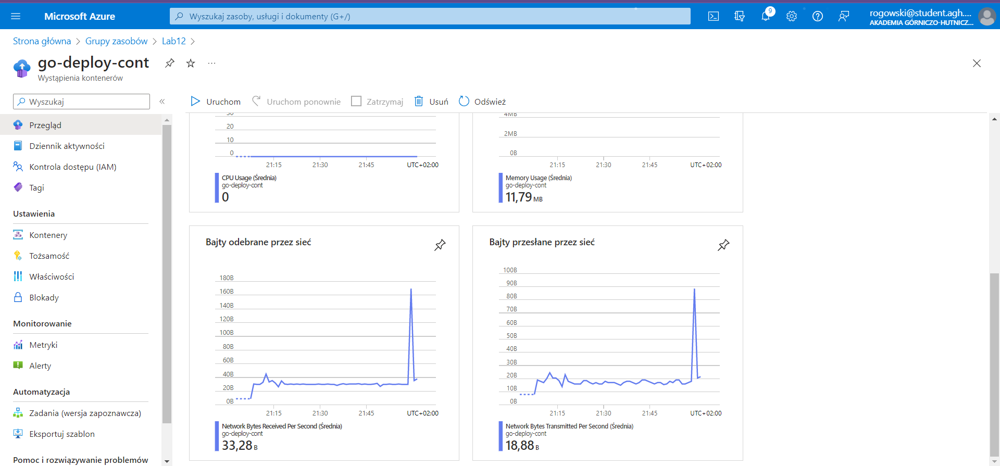  

Przykładowe interakcje z Golangowymi REST API:   
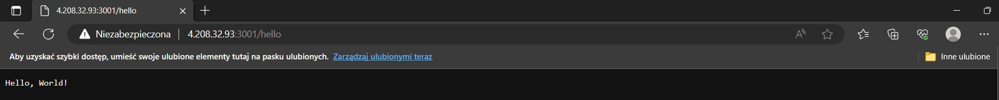  
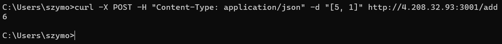  

Wszystko działa poprawnie.

3. Zatrzymanie i usunięcie kontenera:
Usunięcie kontenera było konieczne ponieważ samo istnieje instancji zasobu w postaci kontenera pobiera zasoby, nawet 
w przypadku braku interakcji (znikome wartości, ale jednak).
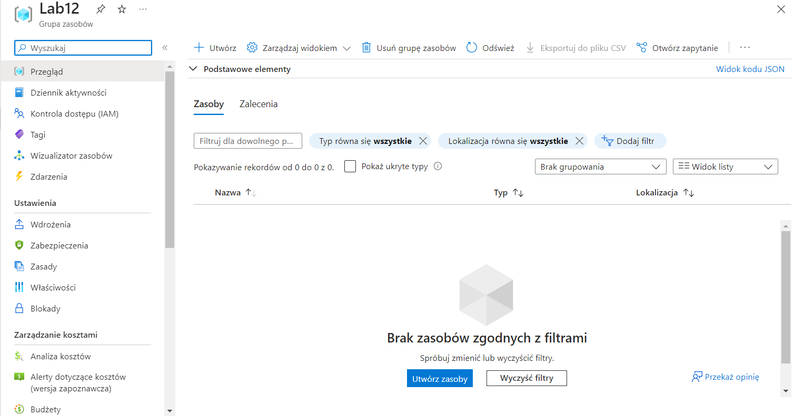  
Dla posprzątania całkowicie po sobie usuwam również "resource group":
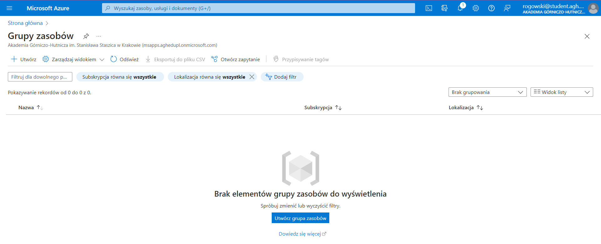  

 

**AWS**:  
Wybrałem Azura z uwagi na mniejszy kontakt i chęć zapoznania z technologią, natomiast nie wiele się to różni od technologii
firmy Amazon, wedle mojej wiedzy o AWS, sprawa wygląda analogicznie, tj. korzysta się z serwisów [**AECS (Amazon Elastic Container Service)**](https://aws.amazon.com/ecs/), aby stworzyć kontener na podstawie 
istniejącej instancji na Docker Hubie, kolejno wykorzystuje się również pojęcie [Tags](https://docs.aws.amazon.com/tag-editor/latest/userguide/tagging.html)
oraz [Resource Groups](https://docs.aws.amazon.com/ARG/latest/userguide/resource-groups.html) -> działa to **całkowicie analogicznie**
jak w przypadku technologii Microsoft, główną różnicą rzucającą się w oczy jest interfejs graficzny ;D, przynajmniej
na poziomie tylko takiego zastosowania, jak zaprezentowano w instrukcji.