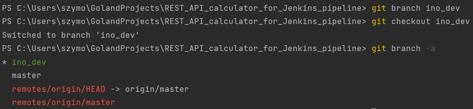

# Sprawozdanie LAB_13:
- Wdrażanie na zarządzalne kontenery w chmurze (II) -> Github Actions

Szymon Rogowski (405244), AGH UST, WIMIIP Faculty

Wykorzystałem repozytorium napisane w Golangu, używane w poprzednich laboratoriach: [used_project](https://github.com/PsimonL/REST_API_calculator_for_Jenkins_pipeline)  

Kolejno po zapoznaniu się z teorią oraz "billingiem", źródła:
- https://docs.github.com/en/actions/learn-github-actions/understanding-github-actions
- https://docs.github.com/en/actions/examples
- https://docs.github.com/en/actions/automating-builds-and-tests/about-continuous-integration
- https://docs.github.com/en/actions/deployment/about-deployments/deploying-with-github-actions
- https://docs.github.com/en/billing/managing-billing-for-github-actions/about-billing-for-github-actions

Przystąpiłem do realizacji laboratorium:

1. Operacja **clone** dla wspomnianego repozytorium na lokalnego hosta, maszynę fizyczną, na której postawione są wirtualizatory, "hypervisory" - uznałem, 
że nie ma sensu korzystania z wirtualki z uwagi na wygodę pracy w dedykowanym środowisku IDE dla języka GO o nazwie Golang,
od firmy JetBrains, które mam zainstalowane jedynie na swoim komputerze. Ponad to nie wykonuje się żadnych interakcji z wirtualką
w tym labie, wykorzystam maszynę wirtualną jedynie do spushowania zmian i wysłania sprawozdania.
Zatem swój projekt: 
```
git clone <URL>
```
2. Zmiana gałęzi na **ino_dev**:
  

3. Usunięcie zawartości folderu: **.github/workflow** oraz ponowne dodanie z odpowiednim plikiem wykorzystywanym do budowania
projektu
    
  

Finalny wygląd workflow **build.yaml**:  
```
name: Build

on:
  push:
    branches:
      - ino_dev

#on:
#  pull_request:
#    branches:
#      - ino_dev

jobs:
  build:
    # GitHub-hosted runners
    # https://docs.github.com/en/actions/using-github-hosted-runners/about-github-hosted-runners
    # https://stackoverflow.com/questions/70959954/error-waiting-for-a-runner-to-pick-up-this-job-using-github-actions

    # Working OS for workflow/job
    runs-on: ubuntu-latest # ubuntu-21.04

    steps:
      - name: Pull code for workflow env
        # Official actions provided by GitHub to download source code to work env for workflow - in my case latest Ubuntu version
        uses: actions/checkout@v2

      - name: Set up Go
        # Official actions provided by GitHub to set up Go
        uses: actions/setup-go@v2
        with:
          go-version: '1.17'

      - name: Install dependencies
        # Download all dependencies required for Go build procedure for my project (Rest Api GO calculator).
        run: go mod download

      - name: Build
        # Compile source code and save it as binary, executable file.
        run: go build -o REST_API_calculator_for_Jenkins_pipeline

      - name: Configure Git
        # Configure IDs for user which are going to bed used during commit operation.
        run: |
          git config --global user.email "szymon0r0official@gmail.com"
          git config --global user.name "Szymon Rogowski"

      - name: Commit changes
        # Finally commit changes, and next commit goes into remote ino_dev, which is in procedure of pull request to master branch.
        run: |
          git add .
          git commit -m "Added build.yaml, check if build passes"
          git push origin ino_dev
```

4. Otworzenie Pull Requesta i wysłanie ostatniego pusha z locala na remote **ino_dev**. "Fail" workflow jest zaznaczany w 
PR, natomiast nie uniemożliwia on mergowania plików, tj. można zmergować z masterem nawet w momencie, gdy akcja nie przeszła
wszystkich kroków zdefiniowanych w **build.yaml** - natomiast da się to zmienić w settingsach repozytorium GitHuba, zmienić wymagania 
co do zaliczenia wszystkich akcji, aby połączyć historie commitów z główną gałęzią. Aby 
wymusić pomyślne zakończenie akcji należało by ustawić poprawnie tzw. "Branch protection rules", bodajże:
```
Settings > Branches > Add branch protection rule
```
Następnie w liście "Protect matching branches", należy wybrać "Require status checks to pass before merging" z opisem:
"Choose which [status checks](https://docs.github.com/en/rest/commits/statuses?apiVersion=2022-11-28) must pass before 
branches can be merged into a branch that matches this rule. When enabled, commits must first be pushed to another branch, 
then merged or pushed directly to a branch that matches this rule after status checks have passed."  

Fail workflow:  
  
Passed workflow:  


5. Weryfikacja poprawnego builda powinna się odbyć bodajże poprzez analize logów zwracanych przez serwer na którym działa
ten workflow, pipeline, dla step o nazwie "Build" widoczne jest poprawne wykonanie kroku:  
  

Całość działa poprawnie i zostaje zmergowana do mastera, a gałąź ino_dev zostaje usunięte, co widoczne jest w historii commitów: [commits_history](https://github.com/PsimonL/REST_API_calculator_for_Jenkins_pipeline/commits/master)

Natomiast historia akcji jest dostępna pod hyperlinkiem: [actions_history](https://github.com/PsimonL/REST_API_calculator_for_Jenkins_pipeline/actions)
